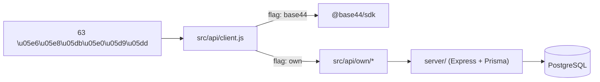

קרא את `AGENTS.md` לפני תחילת העבודה.  
מסמכים נלווים: [`project-audit.md`](./project-audit.md), [`PROJECT_STATE.md`](./PROJECT_STATE.md), [`PROJECT_MASTER_DOCUMENT.md`](./PROJECT_MASTER_DOCUMENT.md).

# תוכנית הסרת Base44

> **עודכן 2026-08-03.** אף מילסטון לא בוצע עדיין. הסעיפים למטה משמרים את התוכנית המקורית ומתקנים ספירות/היקפים שהתיישנו.

---

## עדכונים מאז התוכנית המקורית

הפרויקט השתנה מאז כתיבת התוכנית. **אין שינוי בעקרונות** (facade, דגלים, שחזור נאמן, Postgres+Prisma, נתוני דמו) — יש שינוי בהיקף.

### מה נוסף בפרויקט ומשפיע על התוכנית

| שינוי | השפעה על התוכנית |
|---|---|
| **`base44.agents.*` פעיל** ב-`OwnerAgentChat.jsx` | נדרש **מילסטון 16** או הכרעה לזנוח |
| **סנכרון יומן דו־כיווני** — SyncState, syncGoogleCalendar, 2 workflows, CalendarSyncCard | מילסטון 8 ≈**4-5 ימים**; מילסטון 9 צריך cron + webhook |
| **מערכת ביקורות מלאה** (08-03) — Review lifecycle, `finalizeReviewAutoPublish`, workflow עם `wait` PT12H/PT48H, UI לקוח/בעלים/אדמין | מילסטון 4 (סכמה מורחבת); **מילסטון 9 גדל** (delayed jobs); מילסטון 11 (UploadFile×3); מרשם 22–24 |
| **`pushInAppNotification` מהדפדפן** (ביקורות) | החמרת פריט 4; 9 אתרי `functions.invoke` |
| **14 ישויות** | מילסטונים 0, 4, 4.5 |
| **62 מייבאים** + DateSearchWidget (=63) | מילסטון 2; אצווה reviews=2; superadmin=9; customer=6; hooks=4 |
| **7 מנויי `.subscribe()`** | מילסטון 6 |
| **5 פונקציות / 11 workflows** | מילסטונים 8–9, 14 |
| SDK `^0.8.41` | ספירות בלבד |
| תמחור `weekday_price`/`weekend_price` | פריט דחוי 21 |
| `CustomerBookingsTab` תוקן חלקית | פריט 2 — צומצם, לא נסגר |
| `react-markdown` בשימוש | להסיר מרשימת החבילות הלא־בשימוש |
| `migration-base44-zimmerpro-map.md` נמחק | הנחת ZimmerPro בטלה |

### הכרעות חדשות שנדרשות לפני המשך

1. **האם משחזרים את הסוכן `zimmer_manager`?** אם לא — חיסכון 5-8 ימים. אם כן — מילסטון 16 חוסם.
2. **Webhook של Google Calendar מול "אין endpoint HTTP ציבורי" (מילסטון 9).** cron-only או endpoint מאומת-טוקן.
3. **האם משחזרים wait-jobs לביקורות (12/48ש׳)?** נדרש מנגנון delayed jobs ב-backend החדש, או שינוי התנהגות מאושר.

### הערכה מעודכנת

| | מקורי | 08-02 | 08-03 ספירות | **אחרי סקירת אסטרטגיה** |
|---|---|---|---|---|
| מיגרציה ליבה (-1..14 + 8.5, ללא סוכן) | 24-30 | 32-40 | 34-43 | **35-44** |
| מילסטון 16 (סוכן) | — | 5-8 | 5-8 | **5-8** (או 0.5 בזניחה) |
| מילסטון 15 (דחויים) | 12-16 | 14-19 | 16-22 | **16-22** |
| **סה"כ עם סוכן** | 36-46 | 51-67 | 55-73 | **56-74** |
| **סה"כ בזניחת סוכן** | — | — | — | **51-66** |

---

## סקירת אסטרטגיה — אימות מילסטונים (2026-08-03)

אומת מול הקוד: אין `server/`, אין facade, אין git, אין `.env.local`, 14 ישויות, 5 פונקציות, 11 workflows, 62 מייבאים.

### טבלת אימות

| מילסטון | סטטוס | עדיפות | הערה |
|---|---|---|---|
| **-1** תנאים | ✅ נשאר | **P0 חוסם** | בלי git/appId אין היפוך ואין הרצה |
| **0** קו בסיס | ✅ נשאר | **P0** | שערי lint/typecheck עיוורים — חובה לתקן |
| **1** facade | ✅ נשאר | **P0 quick-win** | **מומלץ כמילסטון יישום ראשון אחרי -1/0** |
| **2** צרכנים | ✅ נשאר | **P0** | 63 צרכנים; מכני, סיכון נמוך |
| **3** שלד server | ✅ נשאר | **P0** | מפריד סיכון תשתית מלוגיקה |
| **4** entities | ✅ נשאר | **P0** | ליבה; סיכון גבוה |
| **4.5** authz | ✅ נשאר | **P0** | מדידה לפני שחזור; לא לדלג |
| **5** auth | ✅ נשאר | **P0** | כבד ביותר בנתיב הקריטי |
| **6** realtime | ✅ נשאר | **P1** | 7 מנויים; אחרי entities+authz |
| **7** geocode | ✅ נשאר | **P2 quick-win** | קטן; ניתן במקביל אחרי M5 |
| **8** calendar | ✅ נשאר | **P1** | סיכון גבוה; תלוי הכרעת webhook |
| **8.5** notify/finalize | 🆕 **נוסף** | **P1** | היה חסר — push+finalize לא היו בבעלות מילסטון |
| **9** workflows | ✅ נשאר | **P1** | תלוי 8.5 ל-finalize; wait-jobs |
| **10** LLM | ✅ נשאר | **P1** | ליבת מוצר; מקבילי ל-7 אחרי M3 |
| **11** upload | ✅ נשאר | **P1** | ×3 כולל ReviewForm |
| **12** vite-plugin | ✅ נשאר | **P0 סוף** | רק כשכל הדגלים=`own` |
| **13** הסרת SDK | ✅ נשאר | **P0 אל-חזור** | |
| **14** ניקוי | ✅ נשאר | **P0** | |
| **15** דחויים | ✅ נשאר | **P2 אחרי יציבות** | לא במהלך מיגרציה |
| **16** סוכן | ✅ נשאר (אופציונלי) | **P3** | מומלץ זניחה או דחייה אחרי ליבה |

### מה לא הוסר
אין מילסטון מיושן להסרה. הנחת ZimmerPro כבר בוטלה. מספור 16 נשמר מסיבות היסטוריות (לא לשנות IDs באמצע תיעוד).

### מה נוסף ולמה
**מילסטון 8.5** — `pushInAppNotification` נקרא מ-9 אתרי invoke בדפדפן; `finalizeReviewAutoPublish` נקרא מ-workflow. קודם היו "מסתתרים" בתוך M9 בלי endpoint/דגל functions מפורש. בלי 8.5, הפיכת `VITE_BACKEND_FUNCTIONS=own` שוברת ביקורות והתראות.

### עדכון עדיפויות (P0→P3)
- **P0 נתיב קריטי:** -1 → 0 → 1 → 2 → 3 → 4 → 4.5 → 5 → (12→13→14 בסוף)
- **P1 ליבת מוצר:** 6, 8, **8.5**, 9, 10, 11
- **P2 משני / quick-win:** 7; מילסטון 15 אחרי פרודקשן
- **P3 אופציונלי:** 16 (סוכן) — הכרעה לפני M5 מומלצת

### עדכון תלויות (גרף מקוצר)
```
-1 → 0 → 1 → 2 → 3 → 4 → 4.5 → 5
                              ├→ 6
                              ├→ 7
                              ├→ 8 → 8.5 → 9
                              ├→ 10 → (16 אם מאושר)
                              └→ 11
כל P1 ירוק + (16 או זניחה) → 12 → 13 → 14 → 15
```

### עדכון סיכונים (מילסטון)
| דירוג | מילסטון | סיכון |
|---|---|---|
| 1 | **5** auth | חוסם את כל האפליקציה בכשל |
| 2 | **4** entities | פורמטי תאריכים / User מיוחד / JSONB |
| 3 | **16** agent | כלי DB + מחיקות; משטח תקיפה |
| 4 | **8** calendar | OAuth, webhook, כתיבה חוצת-דיירים |
| 5 | **9** workflows+wait | delayed jobs; דיוק old_data |
| 6 | **4.5** authz | מדידה לא חד-משמעית → שחזור שגוי |
| 7 | **8.5** push/finalize | שחזור נאמן = השארת endpoints ללא auth |

---

## הכרעות שנקבעו

- backend חדש בתוך הרפו הזה (תיקיית `server/`).
- PostgreSQL + Prisma.
- אין מיגרציית נתונים - נתוני דמו בלבד, התחלה נקייה.
- LLM: שכבת ספק בצד השרת, OpenAI כברירת מחדל (Structured Outputs) + Gemini לקריאה שצריכה עיגון באינטרנט.
- אחסון קבצים: החלטה נדחית. מילסטון 11 בונה ממשק מופשט עם מימוש דיסק מקומי כברירת מחדל, כך שההחלטה תתקבל בהמשך בשינוי קובץ אחד.
- **שחזור נאמן בכל המקרים.** אותרו באגים ופרצות במערכת הקיימת (כיום **24 פריטים** במרשם, היה 21 ב-08-02 / 15 במקור). ההכרעה היא לשחזר את ההתנהגות הקיימת בכולם, בלי לתקן דבר במהלך המיגרציה. כל אחד מהם מתועד עם פתרון מוצע ב"מרשם התיקונים הדחויים", ומטופל במילסטון 15 לאחר שהמערכת החדשה יציבה.

### מה המשמעות המעשית של "שחזור נאמן"

זה מוריד סיכון בשלב המיגרציה, כי כל שינוי התנהגות הוא סיכון. אבל שני דברים חייבים להיות מובנים במפורש:

1. **במקומות אחדים "שחזור" אינו פעולה פסיבית אלא כתיבה אקטיבית של קוד מתירני.** ב-backend חדש, ברירת המחדל היא שאין הרשאות עד שכותבים אותן. לכן שחזור ההתנהגות הפתוחה של `AdminPermission`, `SystemMessage`, `updateMe`, וגם **`SyncState` הגלובלי** ו-**מצב עריכה של הסוכן** דורש כתיבה מכוונת של קוד שמתיר אותן. זה נעשה, אבל מתועד בקוד עצמו כהפניה לפריט במרשם.
2. **בהרשאות אין "כמו שהוא" שניתן להעתיק מהקוד.** **12 מתוך 14** הישויות אינן מצהירות על `rls` כלל (היה 11/13), וברירת המחדל של הפלטפורמה אינה נגזרת מהייצוא. לכן מילסטון 4.5 אינו מילסטון החלטה אלא מילסטון מדידה: מריצים ניסוי מול Base44 החי, מתעדים מה באמת מותר ומה חסום, ומשחזרים בדיוק את זה.

## מה בדיוק צריך להיעלם

✏️ **ספירות מעודכנות 2026-08-03** (אומתו בגריפ):

- 2 חבילות npm: `@base44/sdk@^0.8.41`, `@base44/vite-plugin@^1.0.30`.
- **62 קבצים** מייבאים `base44` מ-`@/api/base44Client`, בתוספת `src/api/base44Client.js`, ובתוספת `DateSearchWidget.jsx` שמקבל `base44` כפרמטר. סך צרכנים: **63**.
- **14 ישויות**, 7 מתודות נתונים, **7 מנויי** realtime (entity), 12 מתודות auth, `users.inviteUser` (4 אתרים), **5 פונקציות שרת** (`geocodeAddresses`, `addBookingToCalendar`, `pushInAppNotification`, `syncGoogleCalendar`, **`finalizeReviewAutoPublish`**), 2 אינטגרציות Core (`InvokeLLM`×13, `UploadFile`×3), **ו-5 מתודות `agents.*`**.
- תיקיית `base44/`: **14** סכמות, **5** פונקציות Deno, **11** workflows (8 entity + 1 scheduled + 1 connector + **1 entity+wait לביקורות**), agent אחד (**פעיל בממשק**), connector אחד.
- קריאה ישירה ל-API ב-`AuthContext.jsx:38` (`public-settings`) דרך `createAxiosClient` פנימי.
- נכסי CDN: favicon מ-`base44.com`, ו-`media.base44.com` ב-`image.jsx`.

## החוזה שצריך לשחזר בדיוק

זו נקודת ההקלה המרכזית בתוכנית. הסמנטיקה של `entities` פשוטה בפועל:

- `.filter(query, sort?, limit?)` - `query` הוא תמיד אובייקט שטוח של שוויון בלבד, למשל `{ owner_id: ownerId }`, `{ zimmer_id, status: 'פעיל' }`, `{ audience: 'customer' }`. אין operators, אין קינון, אין `$or`.
- `sort` הוא תמיד מחרוזת יחידה בפורמט `'-created_date'` או `'-updated_date'`.
- `limit` הוא מספר.
- `.list(sort?, limit?)`, `.get(id)`, `.create(data)`, `.update(id, data)`, `.delete(id)`, `.subscribe(cb)`.
- `.bulkCreate()` ו-`.schema()` לא בשימוש בכלל.
- כל הסינון המורכב (תאריכים, תקציב, קיבולת, אזורים) קורה כבר היום בצד הלקוח על התוצאות.
- שדות אוטומטיים שהקוד מסתמך עליהם: `id`, `created_date`, `updated_date`, `created_by_id`, `created_by`.

## עמוד השדרה: seam אחד + דגלי מעבר



שני העקרונות שמורידים את הסיכון:

1. כל ה-UI מדבר מול `src/api/client.js` בלבד. מחליפים מימוש במקום אחד, לא ב-63 מקומות.
2. דגל מעבר לכל תחום בנפרד (`VITE_BACKEND_ENTITIES`, `VITE_BACKEND_AUTH`, `VITE_BACKEND_AI`, `VITE_BACKEND_FILES`, `VITE_BACKEND_REALTIME`, `VITE_BACKEND_FUNCTIONS`, ✏️ **`VITE_BACKEND_AGENTS`**), עם ערכים `base44` או `own`. כל מילסטון נבדק בהחלפת דגל אחד, וההיפוך הוא החזרת הדגל - בלי revert קוד.

הדגלים נמחקים במילסטון 13, אחרי שכל התחומים ירוקים.

---

# מילסטון -1 - תנאים מקדימים

**מטרה:** להעמיד את התנאים שבלעדיהם מילסטון 0 אינו ניתן לביצוע כלל.

**למה נחוץ:** נבדק בפועל על הרפו ואומת: אין git repository, אין `node_modules`, אין `.env`/`.env.local`, `base44/.app.jsonc` מוחרג ב-`.gitignore` שורה 32 ואינו קיים, וה-CLI אינו מותקן. המשמעות כפולה. ראשית, מילסטון 0 דורש הקלטת fixtures מ-8 מסלולים מוגנים, אבל בלי `appId` הקריאה ב-`src/lib/AuthContext.jsx` שורה 38 נכשלת ומחזירה `authError` שחוסם את כולם. שנית, וזו הבעיה החמורה: סעיף ההיפוך של רוב המילסטונים (כיום **18** כולל מילסטון 16) מסתמך על `git revert` או על tag. **בלי git אין לתוכנית אסטרטגיית היפוך בפועל.**

**קבצים לשינוי:** חדש: `.env.local` (לא נכנס ל-git). שינוי: `package.json` (הוספת `leaflet`).

**הצעדים:**
1. `git init` + קומיט ראשוני של כל הרפו + tag `pre-migration`. זה התנאי לכל סעיפי ההיפוך.
2. השגת `VITE_BASE44_APP_ID` מדשבורד Base44, ויצירת `.env.local` עם `VITE_BASE44_APP_ID` ו-`VITE_BASE44_APP_BASE_URL`.
3. `npm ci`.
4. `npm install -g base44@latest`.
5. `npm install leaflet` - `src/components/desktop/SearchMap.jsx` שורות 2-4 מייבא `leaflet` ו-`leaflet/dist/leaflet.css`, אבל החבילה אינה מוצהרת ב-`package.json`. היא נפתרת כיום רק כ-peer dependency (`package-lock.json` שורות 6638-6644, `"peer": true`). מילסטון 13 דורש התקנה נקייה - בדיוק הפעולה שתחשוף את זה, ובנקודת האל-חזור. עלות התיקון: דקה.
6. הבטחת שני חשבונות בדיקה: אחד עם `role: 'admin'` או רשומת `AdminPermission` תואמת, ואחד עם `role: 'owner'` ולפחות צימר אחד. גישת `/superadmin` נשלטת דרך `AdminPermission.filter({ email })` ב-`src/pages/SuperAdminPanel.jsx` שורה 44.
7. ✏️ **הכרעות עסקיות בכתב (חוסמות תכנון):** (א) שחזור סוכן או זניחה; (ב) webhook יומן או cron-only; (ג) שחזור wait-jobs לביקורות או פישוט. בלי אלה M8/M9/M16 נתקעים באמצע.

**תלויות:** אין. זה הראשון.

**אימות:** `base44 dev` עולה; כל 11 המסלולים נגישים בשני החשבונות; `git log` מציג את הקומיט הראשוני ואת ה-tag; `/desktop-search` מציג מפה; שלוש ההכרעות מתועדות.

**היפוך:** לא נדרש.

**היקף:** **1-1.5 יום** (היה 1; +הכרעות).

**עדיפות:** P0 חוסם.

**סיכונים:** השגת ה-`appId` תלויה בגישה לדשבורד Base44 - תלות חיצונית שיכולה לעכב את כל התוכנית. כדאי לוודא אותה לפני שמתחילים. `min-release-age=7` ב-`.npmrc` עשוי להשפיע על `npm install leaflet` - ראה מילסטון 3.

---

# מילסטון 0 - קו בסיס, תיקון שערי האימות, והוכחת אי-שינוי

**מטרה:** לחבר את שערי האימות שכל התוכנית נשענת עליהם, ואז לתעד את ההתנהגות הקיימת.

**למה נחוץ:** שני חלקים.

החלק הראשון הוא הקריטי, והוא בעל השפעה על כל המילסטונים. שני קבצי התצורה עיוורים בדיוק לקבצים שהתוכנית משנה, ואומת בקריאה ישירה:

- `jsconfig.json` שורה 20: `exclude` מכיל `"src/api"` ו-`"src/lib"`. כלומר `typecheck` **אינו בודק** את `src/api/client.js` שהוא הלב של מילסטון 1, את `src/api/own/*` שהם כל המימושים החדשים של מילסטונים 4 עד 11, את `src/lib/AuthContext.jsx` שמשתנה במילסטון 5, ואת `src/lib/app-params.js` שמשתנה במילסטונים 5 ו-13.
- `jsconfig.json` שורה 19: `include` הוא `"src/components/**/*.js"` - אבל כל הרכיבים בפרויקט הם `.jsx`. בפועל הכיסוי מצטמצם כמעט רק ל-`src/pages/*.jsx`.
- `eslint.config.js` שורות 9-14: `files` אינו כולל את `src/api/**`, `src/hooks/**`, `src/App.jsx`, `src/main.jsx`, ו-`ignores` בשורה 14 מוציא את `src/lib/**/*` במפורש.
- שני הקבצים מפנים ל-`src/Layout.jsx` שאינו קיים ברפו.

המשמעות: ההצהרה "`npm run lint` ו-`npm run typecheck` עוברים" היא אות שקרי. היא תישאר ירוקה גם אם `src/api/client.js` שבור לחלוטין. **בלי התיקון הזה, התוכנית בונה שערי אימות על מכשיר שלא מחובר.**

החלק השני: הדרישה "אין שינוי פונקציונליות" אינה ניתנת לאימות בלי snapshot של המצב הנוכחי.

**קבצים לשינוי:**
- `jsconfig.json` - להסיר `"src/api"` ו-`"src/lib"` מ-`exclude`; לשנות `"src/components/**/*.js"` ל-`"src/**/*.{js,jsx}"`; להסיר את ההפניה ל-`"src/Layout.jsx"`.
- `eslint.config.js` - להוסיף `"src/api/**"`, `"src/hooks/**"`, `"src/lib/**"`, `"src/App.jsx"`, `"src/main.jsx"` ל-`files`; להסיר `"src/lib/**/*"` מ-`ignores`; להסיר את ההפניה ל-`"src/Layout.jsx"`.
- חדש: `docs/migration/baseline.md`, `docs/migration/api-contract.md`, `docs/migration/recorded-payloads/`, `docs/migration/deferred-fixes.md`.

**תוספת מומלצת (לא חובה):** אין ErrorBoundary בפרויקט ו-`src/main.jsx` אינו עוטף ב-`<React.StrictMode>`. במיגרציה ארוכה, שגיאת רינדור אחת משמעה מסך לבן בלי שום אות. שתי הערות חשובות לפני שמוסיפים: ErrorBoundary משנה את חוויית מצב-השגיאה מהמסך הלבן הקיים למסך שגיאה, ו-StrictMode מייצר רינדור כפול בפיתוח שעלול לחשוף באגים קיימים ולהיראות כרגרסיה. לכן אם מוסיפים, להוסיף כאן ולא באמצע התוכנית, ולתעד את שני השינויים בקו הבסיס.

**תלויות:** מילסטון -1.

**אימות:**
- אחרי תיקון התצורה: `npm run typecheck` ו-`npm run lint` רצים ומדווחים על **כל** הקבצים. לתעד את מספר השגיאות הפתוחות כקו בסיס מוסכם, או לתקן אותן.
- `npm run build` עובר ומתועד.
- מילוי צ'קליסט ידני על 11 המסלולים בשני חשבונות הבדיקה: `/`, `/welcome`, `/admin-login`, `/chat`, `/promotions`, `/owner`, `/superadmin`, `/join`, `/account-settings`, `/customer-portal`, `/desktop-search`.
- הקלטת גוף התשובה האמיתי עבור כל **14** הישויות (כולל `SyncState`) + `auth.me()` + `public-settings` + דגימת `agents.*` / webhook יומן, ושמירתם כ-JSON. אלה ה-golden fixtures למילסטונים 4, 4.5, 5, 8 ו-16.

**היפוך:** revert של קומיט התצורה. ה-tag `pre-migration` ממילסטון -1 הוא רשת הביטחון.

**היקף:** 1-1.5 יום. תיקון התצורה יחשוף שגיאות שהיו מוסתרות - זו הנקודה, וצריך להקציב לזה חצי יום.

**סיכונים:** צ'קליסט חלקי מוביל לרגרסיות שלא יאותרו. סיכון שני: אם תיקון ה-lint/typecheck חושף עשרות שגיאות, יש פיתוי לדחות אותו - אין לעשות זאת, כי אז כל התוכנית מאבדת את שער האימות שלה.

---

# מילסטון 1 - יצירת ה-facade כמעבר שקוף

**מטרה:** ליצור `src/api/client.js` שחושף `entities`, `auth`, `functions`, `integrations`, `users`, **ו-`agents`** - ומממש אותם בשלב זה בהעברה ישירה ל-`base44` הקיים.

**למה נחוץ:** בלי seam יחיד, כל החלפת backend נוגעת ב-**63** צרכנים בו-זמנית. זה הצעד היחיד שהופך את כל השאר לקטן והפיך.

**קבצים לשינוי:** חדש: `src/api/client.js`. `src/api/base44Client.js` נשאר בדיוק כמו שהוא. אין נגיעה בצרכנים.

**תלויות:** מילסטון 0.

**אימות:** `npm run build` ו-`npm run typecheck` עוברים - וכעת הם באמת בודקים את `src/api/`, אחרי תיקון מילסטון 0. בדיקה שה-facade מעביר את אותן רפרנסים בדיוק. הרצת האפליקציה - התנהגות זהה, כי אף אחד עוד לא משתמש בו.

**היפוך:** מחיקת הקובץ החדש. אפס השפעה.

**היקף:** 0.5 יום.

**סיכונים:** מינימלי. הסיכון היחיד הוא הוספת לוגיקה ב-facade בשלב הזה - אסור. השלב הזה חייב להיות העברה טהורה.

---

# מילסטון 2 - העברת הצרכנים ל-facade, באצווֹת קטנות

**מטרה:** להביא למצב שבו `src/api/base44Client.js` מיובא ממקום אחד בלבד - מ-`src/api/client.js`.

**למה נחוץ:** זה מה שמנתק את ה-UI מהחבילה של Base44 ומאפשר להחליף מימוש בלי לגעת ב-UI שוב.

**קבצים לשינוי:** שינוי מכני של שורת import בלבד. הספירות אומתו בגריפ ישירות, באצוות נפרדות, כל אצווה קומיט משלה:
- אצווה 2a - ליבה: **4 קבצים**. `src/lib/AuthContext.jsx`, `src/lib/PageNotFound.jsx`, `src/hooks/useUnreadNotifications.js`, `src/hooks/useOwnerSystemUnread.js`.
- אצווה 2b - `src/pages/`: **15 קבצים**.
- אצווה 2c - `src/components/owner/`: **15 קבצים**.
- אצווה 2d - `src/components/superadmin/`: **9 קבצים** (כולל `SuperAdminReviewsPanel.jsx`).
- אצווה 2e - `src/components/customer/`: **6 קבצים** (כולל `CustomerReviewsTab.jsx`).
- אצווה 2f - `src/components/chat/` + `src/components/desktop/`: **5 קבצים** + `DateSearchWidget.jsx` כפרמטר.
- אצווה 2g - `src/components/admin/`: **6 קבצים**.
- אצווה 2h - `src/components/reviews/`: **2 קבצים** (`ReviewForm.jsx`, `ReviewsSection.jsx`).

סך הכל **62** מייבאים + `DateSearchWidget.jsx` = **63** צרכנים.

**תלויות:** מילסטון 1.

**אימות:** לכל אצווה בנפרד: `npm run build` + `npm run lint` + `npm run typecheck`, והרצה ידנית של המסלולים שהאצווה נוגעת בהם מול הצ'קליסט של מילסטון 0. בסוף האצווה האחרונה: חיפוש `@/api/base44Client` מחזיר תוצאה אחת בלבד, מתוך `src/api/client.js`.

**היפוך:** revert של הקומיט של האצווה הבודדת. כל אצווה עומדת בפני עצמה.

**היקף:** 1-1.5 יום.

**סיכונים:** נמוך אבל לא אפסי - שינוי מכני בהיקף רחב מזמין טעויות העתקה. שני מקרים שדורשים תשומת לב מיוחדת: `src/components/chat/DateSearchWidget.jsx` שמעביר `base44` הלאה כפרמטר ל-`getBookedZimmerIds` ול-`getBookedRangesForZimmer` (שורות 15 ו-23) - זהו הצימוד העקיף היחיד בפרויקט; ו-`src/lib/AuthContext.jsx` שמייבא בשורה 4 גם `createAxiosClient` מנתיב פנימי של ה-SDK - הייבוא הזה נשאר בשלב הזה וייטופל במילסטון 5.

---

# מילסטון 3 - שלד backend, ללא חיבור לאפליקציה

**מטרה:** להעמיד `server/` עם Express + Prisma + Postgres ונקודת קצה `GET /api/health` בלבד, ולהכריע על `.npmrc`.

**למה נחוץ:** מפריד את סיכון התשתית (חיבור DB, מיגרציות, סביבה) מסיכון הלוגיקה. אם התשתית נשברת, זה קורה כשאף מסלול מוצר לא תלוי בה.

**הכרעה על `.npmrc` - כאן ולא במילסטון 14:** תוכן הקובץ אומת. אין בו רגיסטרי של Base44 כלל, אלא `min-release-age=7` - מדיניות שמונעת התקנת גרסה שפורסמה בשבוע האחרון. שתי השלכות שנוגעות דווקא למילסטון הזה: מילסטונים 3 ו-10 מתקינים חבילות חדשות (Express, Prisma, ה-SDK של OpenAI, ה-SDK של Google), וההגדרה עשויה לחסום גרסאות עדכניות. במכונת הפיתוח מותקן npm 10.9.2 שבו ההגדרה כנראה נבלעת בשקט, אבל בגרסת npm חדשה יותר או ב-CI היא תשפיע - כלומר התנהגות שונה בין סביבות. ובמילסטון 13, שדורש התקנה נקייה בנקודת האל-חזור, זה בדיוק המקום שבו הבדל כזה מתגלה. ההכרעה: להשאיר את הקובץ (זו מדיניות אבטחת שרשרת אספקה לגיטימית), אבל לתעד במפורש את גרסת npm הנדרשת ולוודא שההתקנות של מילסטונים 3 ו-10 עוברות תחתיה.

**קבצים לשינוי:** חדש: `server/package.json`, `server/src/index.js`, `server/prisma/schema.prisma`, `docker-compose.yml`, `.env.example`. שינוי: `package.json` (סקריפט `dev:server` ו-`dev:all`), `.gitignore`, `README.md` (דרישת גרסת npm).

**תלויות:** מילסטון 2 (לא חובה טכנית, אבל שומר על סדר).

**אימות:** `docker compose up` מרים Postgres. `npx prisma migrate dev` רץ. `curl /api/health` מחזיר 200. הרצת `npm run dev` של הפרונט - האפליקציה מתנהגת בדיוק כמו קודם, כי היא עדיין מדברת עם Base44. התקנה נקייה עוברת תחת `min-release-age=7`.

**היפוך:** מחיקת `server/` והחזרת `package.json`. אפס השפעה על הפרונט.

**היקף:** 1 יום.

**סיכונים:** בעיות סביבה ב-Windows (חיבור Postgres, מיגרציות Prisma). מומלץ לוודא שהמילסטון הזה ירוק לגמרי לפני שממשיכים.

---

# מילסטון 4 - שכבת הנתונים: מחסן ישויות גנרי

**מטרה:** לממש `/api/entities/:entity` עם החוזה המדויק של Base44 - `list`, `filter`, `get`, `create`, `update`, `delete`.

**למה נחוץ:** **14** הישויות הן הליבה. **63** הצרכנים לא יעבדו בלי החוזה הזה.

**ההכרעה הארכיטקטונית:** טבלה גנרית אחת ב-Prisma - `Record { id, entityType, data Json, createdDate, updatedDate, createdById, createdBy }` עם אינדקס GIN על `data`, ובנוסף אינדקס על `data->>'calendar_event_id'` לתמיכה ב-`syncGoogleCalendar`. הסיבה: הסכמות הן מסמכי JSON Schema עם שדות מקוננים ומערכים (`seasonal_pricing`, `data_zones`, `images`, `target_user_ids`, `messages`) וערכי enum בעברית. מודל JSONB נותן התאמה התנהגותית 1:1 בסיכון כמעט אפסי. החלופה, **14** מודלים מוטפסים מראש, מכניסה תרגום שדות ידני שהוא בדיוק המקום שבו פונקציונליות משתנה בשקט.

**`SyncState`:** ישות סינגלטון לסנכרון יומן (channel/token/expiry). אין לה `rls` — מדידה במילסטון 4.5 ושחזור נאמן (פריט דחוי 18).

**`Review`:** סכמה מורחבת עם מכונת מצבים (`pending_publish` / `pending_owner` / `compromise_offered` / `published` / `disputed` / `removed`) ואובייקט מקונן `settlement_offer`. אין `rls` — מדידה ב-4.5; מעברי סטטוס משוחזרים נאמנה (תיקון בפריטים 22–23).

**`schema-loader.js` חייב לטעון גם את בלוק ה-`rls`, לא רק `properties` ו-`default`.** אומת: `base44/entities/DirectChat.jsonc` שורות 62-123 מכיל RLS מלא על read/create/update/delete, ו-`base44/entities/SystemMessage.jsonc` שורות 66 והלאה מכיל RLS חלקי. אם ה-loader טוען רק סכמה, המידע הזה נזרק לפח והוא בלתי-ניתן לשחזור אחרי מחיקת התיקייה במילסטון 14.

**ולידציה:** ה-loader מממש ולידציה שמשקפת **בדיוק** את מה שהסכמות מצהירות, לא יותר. אותרו שבעה אילוצים חסרים בסכמות עצמן (`Review.rating` בלי `minimum`/`maximum` למרות הכותרת "דירוג (1-5)", `check_out > check_in` לא נאכף, תאריכים כ-`string` בלי `format: date`, `format: email` חסר ב-4 סכמות, ועוד). על פי הכרעת השחזור הנאמן, **אין להוסיף אותם כאן**. הם פריטים 13-15 במרשם התיקונים הדחויים. הערה מעשית: `zod` כבר מותקן ב-`package.json` ואינו בשימוש בשום מקום בפרויקט - הוא הכלי הטבעי גם לוולידציה הנאמנה כאן וגם להידוק במילסטון 15.

**קבצים לשינוי:** חדש: `server/src/routes/entities.js`, `server/src/lib/entity-store.js`, `server/src/lib/schema-loader.js`, `server/prisma/schema.prisma`, `server/tests/contract/`, `server/src/seed/`, `src/api/own/entities.js`. שינוי: `src/api/client.js` (הוספת הדגל).

**תלויות:** מילסטון 3.

**אימות:**
- חבילת contract tests שמשווה כל תשובה מול ה-golden fixtures ממילסטון 0: אותם שמות שדות, אותו פורמט `created_date`, אותו סדר עבור `'-created_date'`, אותה התנהגות `limit`.
- בדיקת round-trip לערכי enum בעברית ולשדות מקוננים.
- בדיקה ששדה חסר מקבל את ה-`default` מהסכמה (למשל `approval_status: 'אושר'`, `seasonal_pricing: []`).
- החלפת `VITE_BACKEND_ENTITIES=own` והרצת כל 11 המסלולים מול הצ'קליסט בשני חשבונות הבדיקה. seed של נתוני דמו נדרש כאן.

**היפוך:** החזרת הדגל ל-`base44`. מיידי, בלי קוד.

**היקף:** 4 יום.

**סיכונים - זה אחד משני המילסטונים המסוכנים:**
- פורמט תאריכים: הקוד עושה גם `new Date(m.created_date)` וגם השוואת מחרוזות (`p.check_out >= todayStr()`). כל שינוי בפורמט שובר לוגיקה בשקט.
- סמנטיקת מיון על `updated_date` ב-`DirectChat.filter({...}, '-updated_date')` - בלי `limit`.
- ברירת מחדל של `limit` כשלא מועבר. אם Base44 מחזירה תקרה מסוימת והשרת החדש מחזיר הכל או פחות, מסכים כמו `SuperAdminDashboard` משתנים.
- `created_by_id` ו-`created_by` נדרשים לסינון בעלות ב-`CustomerBookingsTab`, `UpdatesPopover`, `CustomerUpdatesTab` - וגם 4 מתוך 8 ה-workflows נשברים בלעדיהם. חייבים להיות מאוכלסים אוטומטית מהטוקן.
- ישות `User` מיוחדת: היא הרחבה של משתמש הפלטפורמה. `User.list()`, `User.update()`, `User.delete()` נקראים מפאנל הסופר-אדמין וחייבים לפגוע בטבלת המשתמשים האמיתית, לא במחסן הגנרי.
- **מחיר ארכיטקטוני שיש לתעד כאן ולא לגלות במילסטון 9:** `src/pages/CustomerChat.jsx` שורות 631-646 ו-`src/pages/DesktopSearch.jsx` שורות 97-104 מבצעים check-then-create על זמינות תאריכים בלי אילוץ ייחודיות, כלומר קיים תנאי מרוץ שמאפשר הזמנה כפולה. המחסן הגנרי ב-JSONB מקשה על פתרון נקי, כי אין אינדקס ייחודי טבעי על `zimmer_id` בשילוב טווח תאריכים בתוך `data Json`. ההחלטה על JSONB נשארת - היא נכונה מסיבות אחרות - אבל המחיר מתועד. זהו פריט 9 במרשם.

---

# מילסטון 4.5 - מודל הרשאות: מדידה ושחזור

**מטרה:** לתרגם את מודל ההרשאות של Base44 לשכבת authorization מפורשת בבקאנד החדש, ובמקומות שאין מודל מוצהר - למדוד את ההתנהגות בפועל ולשחזר אותה במדויק.

**למה נחוץ:** זהו הפער החמור ביותר שאותר. מילסטון 5 מכסה authentication (מי אתה) באופן יסודי. **authorization (למה מותר לך לגשת) אינו מכוסה כלל.** מילסטון 4 מייצר מחסן ישויות גנרי; ב-backend חדש ברירת המחדל היא שאין הרשאות עד שכותבים אותן, ולכן בלי המילסטון הזה, ברגע שהדגל `VITE_BACKEND_ENTITIES` מתהפך ל-`own` - כל משתמש מאומת יוכל לקרוא ולכתוב כל רשומה בכל **14** הישויות.

**למה זה מילסטון מדידה ולא מילסטון החלטה:** אומת בגריפ שרק 2 מתוך **14** הישויות מצהירות על `rls`. עבור **12** הנותרות (כולל `SyncState`), ברירת המחדל של הפלטפורמה אינה נגזרת מהקוד המיוצא. לכן "שחזור כמו שהוא" אינו ניתן לביצוע בלי למדוד קודם מה באמת קורה. הניסוי בצעד 1 הוא הבסיס העובדתי לכל המילסטון.

**הצעדים:**

1. **ניסוי קביעת ברירת המחדל.** עם שני חשבונות הבדיקה ממילסטון -1, לנסות לקרוא ולכתוב רשומה של משתמש א' מהחשבון של משתמש ב', על ישות ללא `rls` (למשל `Contact` או `CustomerProfile`), ישירות מול ה-API של Base44 ולא דרך ה-UI. לתעד את התוצאה ב-`docs/migration/authz-baseline.md`. זו העובדה שכל השאר נשען עליה. לחזור על הניסוי לכל אחת מ-4 הפעולות (read/create/update/delete).
2. **תרגום ה-RLS המוצהר.** `base44/entities/DirectChat.jsonc` שורות 62-123 מתורגם ל-middleware: לכל אחת מארבע הפעולות, `$or` של `data.customer_id == user.id`, `data.owner_id == user.id`, או `user.role == 'admin'`. `base44/entities/SystemMessage.jsonc` שורות 66 והלאה: `read: {}` פתוח לחלוטין, ו-`create`/`update`/`delete` מוגבלים ל-`role` בערכים `admin` או `owner`. **שני אלה משוחזרים במדויק, כולל ה-`read` הפתוח.**
3. **12 הישויות ללא `rls` מקבלות בדיוק את ההתנהגות שנמדדה בצעד 1.** לא מדיניות מהודקת, אלא שחזור. אם הניסוי מראה שברירת המחדל פתוחה - השכבה נכתבת פתוחה, עם הערה בקוד שמפנה לפריט הרלוונטי במרשם. `SyncState` נמדד במפורש (פריט 18).
4. **בדיקת ה-admin נשארת בצד לקוח, כפי שהיא היום.** `src/pages/SuperAdminPanel.jsx` שורות 40-53 בודק `AdminPermission.filter({ email })` בדפדפן, והשער היחיד הוא `setAccessDenied(true)` שמריץ `return` ב-React. זה משוחזר כמו שהוא. הפרצה מתועדת כפריט 1 במרשם.

**מה המילסטון הזה אינו עושה:** אינו מוסיף בדיקת admin בצד שרת, אינו מצמצם רשימות רחבות שנותרו (ראה פריט 2 המעודכן), ואינו מגביל את `SystemMessage.read`. כל אלה פריטים במרשם התיקונים הדחויים, על פי הכרעת השחזור הנאמן.

**קבצים לשינוי:** חדש: `server/src/lib/authz.js`, `server/src/middleware/entity-authz.js`, `docs/migration/authz-baseline.md`. שינוי: `server/src/lib/schema-loader.js`, `server/src/lib/entity-store.js`.

**תלויות:** מילסטון 4. גם מילסטון -1, בגלל הצורך בשני חשבונות בדיקה.

**אימות:**
- לכל אחת מ-**14** הישויות ולכל אחת מ-4 הפעולות: התנהגות ה-backend החדש זהה למה שתועד ב-`authz-baseline.md`. זה קריטריון מדיד, בשונה מ"מהודק דיו".
- `DirectChat`: משתמש שאינו `customer_id`, אינו `owner_id` ואינו admin - נחסם, בהתאם ל-RLS המוצהר.
- `SystemMessage`: קריאה פתוחה, בהתאם ל-`read: {}`.
- 11 המסלולים ממשיכים לעבוד תקין לשני חשבונות הבדיקה.

**היפוך:** `VITE_BACKEND_ENTITIES=base44`.

**היקף:** 2-3 יום.

**סיכונים:**
- אם הניסוי בצעד 1 אינו חד-משמעי, כל המילסטון תלוי באוויר. יש להקציב זמן לניסוי מסודר ולא לנחש.
- שחזור נאמן של התנהגות פתוחה משמעו כתיבה מכוונת של קוד מתירני. חובה להוסיף הערה בקוד לכל מקום כזה שמפנה לפריט במרשם, אחרת בעוד חצי שנה אף אחד לא יזכור שזו הייתה החלטה ולא שגיאה.
- המילסטון הזה נכנס בין 4 ל-5 ומאריך את המסלול הקריטי.

---

# מילסטון 5 - auth עצמאי

**מטרה:** להחליף את 12 מתודות ה-auth, את `users.inviteUser`, ואת נקודת הקצה `public-settings`.

**למה נחוץ:** זה השער לכל מסלול מוגן. בלי זה אין אפליקציה.

**קבצים לשינוי:** חדש: `server/src/routes/auth.js`, `server/src/routes/app-settings.js`, `server/src/lib/jwt.js`, `server/src/lib/google-oauth.js`, `server/src/lib/otp.js`, `src/api/own/auth.js`. שינוי: `src/lib/AuthContext.jsx`, `src/lib/app-params.js`, `src/api/client.js`.

**מה חייב להישמר בדיוק:**
- `GET /api/app/public-settings` מחזיר `{ id, public_settings }`, ובכשל מחזיר 403 עם `data.extra_data.reason` בערכים `auth_required` או `user_not_registered` - כי `src/lib/AuthContext.jsx` שורות 54-71 מסתמך על המבנה הזה, ו-`src/App.jsx` שורות 46-53 מרנדר לפיו `UserNotRegisteredError` או מפנה ל-login.
- `PUBLIC_PATHS = ['/', '/welcome', '/admin-login']` ממשיכים להיטען מיד בלי בדיקת auth.
- `auth.me()` מחזיר משתמש עם `id`, `email`, `full_name`, `role`.
- **`auth.loginWithProvider('google', redirectUrl)` נקרא מ-12 מקומות ב-6 קבצים.** הספירה אומתה בגריפ, וזה תיקון משמעותי: `src/pages/Landing.jsx` שורות 54, 60, 92, 98, 190, 195 (יעדים `/join` ו-`/chat`); `src/pages/Welcome.jsx` שורות 14, 15 (`/chat`, `/join`); `src/pages/AdminLogin.jsx` שורה 40 (`/admin-login`); `src/pages/JoinAsOwner.jsx` שורה 40 (`window.location.href` דינמי); `src/pages/Login.jsx` שורה 34 (`next` דינמי); `src/pages/Register.jsx` שורה 70 (`/`). אימות של `Landing.jsx` בלבד היה משאיר את זרימות ההתחברות של `/welcome`, `/admin-login` ו-`/join` - 3 מתוך 11 המסלולים - ללא בדיקה.
- **`users.inviteUser` נקרא מ-4 מקומות בשני תפקידים שונים.** אומת בגריפ: `src/pages/SuperAdminPanel.jsx:82` עם `'owner'`, `src/pages/JoinAsOwner.jsx:21` עם `'owner'`, `src/components/superadmin/AddOwnerPanel.jsx:25` עם `'owner'`, ו-`src/components/superadmin/CustomersPanel.jsx:43` עם **`'user'`**. שני התפקידים חייבים להיתמך.
- `src/pages/JoinAsOwner.jsx` שורה 19 עושה `updateMe({ role: 'owner' })`, ואם זה נכשל - שורה 21 נופלת ל-`inviteUser` בתוך `try { ... } catch (_2) {}` **ריק**. כלומר כשלון נבלע בשקט כבר עכשיו. משוחזר כמו שהוא, ומתועד כדי לא להתבלבל בזמן הבדיקה. זהו פריט 11 במרשם.

**בדיקת ההרשאות ל-`/superadmin`:** מטופלת במילסטון 4.5 ולא כאן. הבדיקה בצד הלקוח ב-`src/pages/SuperAdminPanel.jsx` שורה 44 נשארת כפי שהיא, בהתאם להכרעת השחזור הנאמן.

**תלויות:** מילסטונים 4 ו-4.5.

**אימות:**
- כל מסלול התחברות בנפרד: Google, אימייל וסיסמה, OTP והרשמה, שכחתי סיסמה, איפוס סיסמה.
- **בדיקת התחברות Google בנפרד מכל אחד מ-6 הקבצים, עם אימות שיעד ה-redirect נשמר.** תשומת לב מיוחדת ל-`JoinAsOwner.jsx:40` עם `window.location.href` הדינמי ול-`Login.jsx:34` עם `next`.
- טוקן שפג: מוביל ל-`auth_required` ולהפניה, לא למסך שבור.
- משתמש לא רשום: מציג `UserNotRegisteredError`.
- `logout(true)` ו-`logout(false)` - שתי ההתנהגויות נבדקות בנפרד (`src/lib/AuthContext.jsx` שורות 117-128).
- `inviteUser` מכל 4 המקומות, בשני התפקידים.
- החלפת `VITE_BACKEND_AUTH=own` והרצת כל 11 המסלולים.

**היפוך:** החזרת הדגל ל-`base44`. שינויי `AuthContext.jsx` נכתבים כך ששני המימושים חיים במקביל מאחורי הדגל, כדי שההיפוך לא ידרוש revert.

**היקף:** 5 יום. זה המילסטון הכבד ביותר.

**סיכונים:**
- הגבוה בתוכנית. כשל כאן חוסם את כל האפליקציה.
- `src/lib/app-params.js` קורא טוקן מ-`?access_token=` ב-URL, מוחק אותו מה-URL, ושומר ב-`localStorage` תחת `base44_access_token`, ומוחק גם מפתח `token` ישן. החלפת מפתח האחסון מנתקת סשנים פעילים. מומלץ לקרוא משני המפתחות בתקופת המעבר.
- 4 קבצים - `Login.jsx`, `Register.jsx`, `ForgotPassword.jsx`, `ResetPassword.jsx` - מכילים מתודות auth אך אינם רשומים כ-routes ב-`src/App.jsx`, כלומר אינם נגישים כיום. הם חייבים לעבור מיגרציה כדי שהקוד יתקמפל, אבל אי אפשר לבדוק אותם דרך ה-UI. נדרשת החלטה: לחבר להם routes זמניים לצורך בדיקה, או לתעד אותם כלא-מכוסים.
- `src/components/ProtectedRoute.jsx` אינו בשימוש בכלל. לא לשנות התנהגות - להשאיר אותו עובד מול ה-facade.

---

# מילסטון 6 - החלפת realtime, בשני צעדים

**מטרה:** להחליף את **7** קריאות `.subscribe()` על ישויות בלי לשנות את חתימת ה-callback. בנוסף לתכנן (אך לא לממש כאן) את `agents.subscribeToConversation` למילסטון 16.

**למה נחוץ:** משטחי מוצר תלויים בעדכון חי: התראות לקוח, התראות בעלים (`useOwnerSystemUnread`), צ'אט ישיר, ווידג'ט שאלות, FloatingPendingWidget ×3.

**המסלול הבטוח:** צעד 6a - לממש `subscribe` בתוך `src/api/own/entities.js` כ-polling עם אותה חתימה בדיוק. צעד 6b - להחליף ל-SSE. שני הצעדים נבדקים בנפרד.

**קבצים לשינוי:** `src/api/own/entities.js`, `server/src/routes/events.js` (רק ב-6b). קבצי הצרכנים עם `.subscribe()` נשארים ללא שינוי חתימה.

**תלויות:** מילסטונים 4, 4.5.

**אימות:** בשני חלונות דפדפן במקביל: הודעה חדשה ב-`SystemMessage` מעדכנת מונה לקוח ובעלים; הודעה ב-`DirectChat` מופיעה אצל הצד השני; שאלה חדשה בווידג'ט. אין דליפת מנויים ב-unmount.

**היפוך:** `VITE_BACKEND_REALTIME=base44`, או ב-6b חזרה ל-polling של 6a.

**היקף:** **2-2.5 יום**.

**סיכונים:** polling מייצר עומס ותחושת השהיה שונה. `useUnreadNotifications` מחשב לפי `lastSeen`; `useOwnerSystemUnread` לפי read-set ב-localStorage — לוודא שהחישוב לא נשבר.

---

# מילסטון 7 - פונקציית geocodeAddresses

**מטרה:** להעביר את `base44/functions/geocodeAddresses/entry.ts` ל-backend החדש.

**למה נחוץ:** `src/pages/DesktopSearch.jsx` שורה 50 קוראת לה, ובלעדיה אין מיקומים על המפה.

**קבצים לשינוי:** חדש: `server/src/routes/functions/geocode-addresses.js`, `src/api/own/functions.js`. שינוי: `src/api/client.js`.

**מה משוחזר במדויק:** הפונקציה מאמתת התחברות (שורות 6-7), רצה בלופ **סדרתי ללא השהיה** (שורה 15), פונה ל-Nominatim עם `countrycodes=il&limit=1`, מעבירה `User-Agent: 'ZimmerBot/1.0 (desktop-search)'` (שורה 21), ומחזירה `{ results: [{ address, lat, lng }] }` עם `null` בכשל. הקואורדינטות אינן נשמרות בשום מקום: `src/pages/DesktopSearch.jsx` שורה 17 מחזיק אותן ב-`useState` שנעלם בכל רענון, ול-`Zimmer` אין שדות `lat`/`lng` בסכמה. **כל זה משוחזר כמו שהוא**, כולל היעדר ההשהיה והיעדר הקאשינג. זהו פריט 12 במרשם.

**תלויות:** מילסטון 5 (הפונקציה קוראת `auth.me()`).

**אימות:** אותו מערך כתובות שהוקלט במילסטון 0 מחזיר אותן קואורדינטות באותו מבנה תשובה. בדיקה ב-`/desktop-search` שהמונה "X מתוך Y צימרים ממוקמים על המפה" (שורה 169) מציג את אותו מספר כמו בקו הבסיס.

**היפוך:** `VITE_BACKEND_FUNCTIONS=base44`.

**היקף:** 0.5 יום.

**סיכונים:** ה-`User-Agent` חייב לעבור, אחרת Nominatim חוסם. שחזור הלופ הסדרתי ללא השהיה משמר את הסיכון לחסימה בכתובות רבות - זה מתועד במרשם ולא מתוקן כאן. `coordsCache` בצד הלקוח מסתיר בעיות בפיתוח - לבדוק עם cache נקי.

---

# מילסטון 8 - Google Calendar: יצירה + סנכרון דו־כיווני

**מטרה:** להעביר `addBookingToCalendar` **ו-`syncGoogleCalendar`**, להחליף את `connectors/googlecalendar.jsonc` ב-OAuth עצמאי, ולשחזר את ישות `SyncState` + ערוץ push.

**למה נחוץ:**
- יצירה: `BookingsList.jsx` ו-`OwnerBookingsList.jsx`.
- סנכרון: `CalendarSyncCard.jsx` (פולל כל ~30ש׳), workflow מתוזמן `*/30`, ו-webhook של מחבר Google Calendar.

**קבצים לשינוי:** חדש: `server/src/routes/functions/add-booking-to-calendar.js`, `server/src/routes/functions/sync-google-calendar.js`, `server/src/lib/google-calendar.js`, `server/src/routes/connectors/google-calendar-oauth.js`, `server/src/lib/oauth-token-store.js`, endpoint לקבלת webhook (או חלופה cron-only — הכרעה). שינוי: `src/api/own/functions.js`.

**מה משוחזר במדויק (שחזור נאמן):**
- יומן יחיד ברמת האפליקציה (`asServiceRole` + `calendars/primary`) — פריט 6.
- ללא בדיקת בעלות ב-`addBookingToCalendar` — פריט 5.
- ללא idempotency לפני יצירת אירוע — פריט 7.
- `syncGoogleCalendar`: webhook/workflow יכולים לדלג על `auth.me()` ולרוץ ב-service role; כתיבה ל-`SyncState` סינגלטון — פריטים 17–18.

**תלויות:** מילסטונים 4, 4.5, 5, 7.

**אימות:** אישור הזמנה יוצר אירוע + `calendar_event_id`; אישור חוזר מייצר כפילות (כמו הקו הבסיס); סנכרון מעדכן `SyncState`; `CalendarSyncCard` מציג סטטוס; webhook או cron מריצים sync.

**היפוך:** `VITE_BACKEND_FUNCTIONS=base44`.

**היקף:** **4-5 ימים** (היה 1.5).

**עדיפות:** P1 — סיכון גבוה.

**סיכונים:** גבוה. אחסון טוקנים + רענון, רישום OAuth ב-Google Cloud, וסתירה עם "אין endpoint ציבורי" ממילסטון 9 — חייבת הכרעה מוקדמת.

---

# מילסטון 8.5 - פונקציות התראות וביקורות (push + finalize)

**מטרה:** להעביר ל-backend החדש את `pushInAppNotification` ו-`finalizeReviewAutoPublish`, תחת דגל `VITE_BACKEND_FUNCTIONS`, **לפני** מילסטון 9.

**למה נוסף בסקירת האסטרטגיה:** שתי הפונקציות לא היו בבעלות מילסטון מפורשת. `pushInAppNotification` נקרא מ-5 מקומות בדפדפן (ביקורות) + workflows/agent. `finalizeReviewAutoPublish` נקרא מ-workflow אחרי wait. בלי endpoints אלה, M9 והפיכת דגל functions שוברים את מערכת הביקורות.

**קבצים לשינוי:** חדש: `server/src/routes/functions/push-in-app-notification.js`, `server/src/routes/functions/finalize-review-auto-publish.js`. שינוי: `src/api/own/functions.js`, `src/api/client.js`.

**מה משוחזר נאמנה (פריטים 4/22/24 במרשם):**
- `pushInAppNotification`: ללא `auth.me()`, כתיבה ב-service role, ולידציה מינימלית `if (!title)`.
- `finalizeReviewAutoPublish`: ללא auth, asServiceRole, מפרסם רק אם `pending_publish`/`pending_owner`.

**תלויות:** מילסטונים 4, 4.5, 5. מומלץ אחרי M8 אם משתפים תשתית functions; ניתן במקביל ל-M8 אחרי M5.

**אימות:** יצירת ביקורת שולחת התראה לבעלים; finalize עם review_id במצב pending מפרסם; finalize על published מחזיר skipped.

**היפוך:** `VITE_BACKEND_FUNCTIONS=base44`.

**היקף:** **1-1.5 יום**.

**עדיפות:** P1.

**סיכונים:** שחזור נאמן משאיר פרצות — מתועד במרשם; לא לתקן כאן.

---

# מילסטון 9 - החלפת 11 ה-workflows בטריגרים פנימיים + תזמון + delayed jobs

**מטרה:** לשחזר **8** התראות על אירועי ישויות, cron סנכרון יומן (`*/30`), webhook של מחבר Google Calendar, **ו-Review Auto Publish** (wait PT12H/PT48H → `finalizeReviewAutoPublish`).

**למה נחוץ:** בלעדיהם מפסיקים לקבל התראות, סנכרון היומן נעצר, וביקורות לא מתפרסמות אוטומטית.

**קבצים לשינוי:** חדש: `server/src/lib/notifications.js`, `server/src/lib/entity-hooks.js`, scheduler (node-cron / worker), **job queue / delayed tasks** לביקורות, אופציונלי: `server/src/routes/webhooks/google-calendar.js`, `server/src/routes/functions/finalize-review-auto-publish.js`. שינוי: `server/src/lib/entity-store.js`.

**החלטת תכנון מפורשת — וסתירות שחייבות הכרעה:**
- ל-`pushInAppNotification`: טריגרים פנימיים בלבד עדיפים, **אך כיום נקרא גם מהדפדפן** (ביקורות) — משוחזר נאמנה (פריט 4/24).
- ל-webhook של Google Calendar: endpoint מאומת-טוקן או cron-only.
- ל-Review wait: נדרש מנגנון delayed jobs (Bull/Agenda/pg-boss/setTimeout עמיד) או שינוי התנהגות מאושר.

**הטריגרים המדויקים (8 entity hooks):** ללא שינוי מהרשימה המקורית — BookingRequest create/update×3, UnansweredQuestion create/update, DirectChat update×2.  
**+ Review create** → route לפי status → wait → finalize.

**תלויות:** מילסטונים 4, 4.5, 6, **8**, **8.5** (push+finalize חייבים להיות זמינים לפני hooks).

**אימות:** 8 תרחישי התראות + cron sync + (אם נבחר) webhook + ביקורת 4–5 מתפרסמת אחרי המתנה מדומה + ביקורת שטופלה ידנית נדלגת ב-finalize.

**היפוך:** `NOTIFICATIONS_ENABLED=false` / כיבוי scheduler.

**היקף:** **3-4 ימים** (היה 2-3 ב-08-02 / 1 במקור). Finalize עצמו עבר ל-8.5 — M9 מתמקד ב-hooks+wait+cron.

**עדיפות:** P1.

**סיכונים:** בינוני-גבוה. תנאי `update` חייבים להיות מדויקים. wait חייב לשרוד restart. דליפת תוכן רגיש ל-`SystemMessage` משוחזרת — פריט 3.

---

# מילסטון 10 - שכבת LLM

**מטרה:** להחליף `base44.integrations.Core.InvokeLLM` ב-`POST /api/ai/invoke-llm` עם חוזה קלט זהה.

**למה נחוץ:** **13 קריאות ב-11 קבצים** (הספירה אומתה בגריפ, כולל כל 13 מספרי השורות), כולל כל חוויות הצ'אט והעוזרים - זה לב המוצר.

**החוזה שצריך להישמר:** `{ prompt, response_json_schema?, add_context_from_internet?, model? }`. כשיש `response_json_schema` - התשובה היא אובייקט מפורסר לפי הסכמה. כשאין - התשובה היא מחרוזת.

**הפיצול המדויק, 8 עם סכמה ו-5 בלי:**
- עם סכמה: `src/pages/CustomerChat.jsx:369`, `src/pages/CustomerChat.jsx:559`, `src/components/desktop/SearchChat.jsx:124`, `src/components/desktop/SearchChat.jsx:188`, `src/components/owner/BookingCreatorChat.jsx:47`, `src/components/owner/OwnerInfoAssistant.jsx:257`, `src/components/admin/AdminAssistantChat.jsx:113`, `src/components/admin/ZimmerCreatorChat.jsx:111`.
- בלי סכמה: `src/components/chat/VacationAgentChat.jsx:109` (וגם `add_context_from_internet: true` ו-`model: 'gemini_3_flash'`), `src/components/owner/OwnerDashboard.jsx:96`, `src/components/owner/ZimmerDatabase.jsx:44`, `src/components/admin/InfoSummaryEditor.jsx:43`, `src/components/superadmin/ChatHistoryPanel.jsx:22`.

שני קבצים תלויים בכך שהתשובה היא מחרוזת ולא אובייקט: `src/components/admin/InfoSummaryEditor.jsx` שורה 44 מטפל גם ב-`res.text`/`res.message`, ו-`src/components/owner/ZimmerDatabase.jsx` שורה 45 משתמש בתוצאה ישירות כטקסט. הבדל כאן שובר אותם בשקט.

**המימוש:** ספק מופשט בצד השרת. OpenAI כברירת מחדל עם Structured Outputs עבור 8 הקריאות עם סכמה, כי היא מבטיחה התאמה לסכמה ולא רק מנסה. Gemini עבור הקריאה עם `add_context_from_internet: true`, דרך Google Search grounding.

**מה משוחזר במדויק:** ה-`prompt` מועבר כפרמטר בודד, ללא הפרדת system/user בשרת. אותרה חשיפה: קלט משתמש גולמי משורשר לתוך תבנית ההוראות בלי הפרדה או escaping (`src/pages/CustomerChat.jsx` שורות 539-544), ו-`Zimmer.data_zones` הוא טקסט חופשי שנכנס מ-`ZimmerCreatorChat` ומ-`QuestionsPanel.jsx:46-51` ומוזרק לכל prompt של לקוח - כלומר stored prompt injection שבו בעל מתחם יכול לשתול הוראות שישפיעו על שיחות של לקוחות אחרים. הווקטור החמור הוא `src/components/owner/OwnerInfoAssistant.jsx`, שבו פלט ה-LLM מתורגם לפעולות DB אמיתיות (`Zimmer.update` שורה 148, `Zimmer.create` שורה 122, `BookingRequest.create` שורה 161), וההגנה היחידה היא הוראה ל-LLM לנסח כבקשת אישור בשורה 226 ועוד preview ב-UI - כלומר הגנה שמסתמכת על ציות המודל ולא על אכיפה. **כל זה משוחזר כמו שהוא.** זהו פריט 8 במרשם.

**קבצים לשינוי:** חדש: `server/src/routes/ai.js`, `server/src/lib/llm/index.js`, `server/src/lib/llm/openai.js`, `server/src/lib/llm/gemini.js`, `src/api/own/integrations.js`. שינוי: `src/api/client.js`, `.env.example`. אין שינוי ב-11 קבצי הצרכנים.

**תלויות:** מילסטון 3.

**אימות:** בדיקה נפרדת לכל 13 אתרי הקריאה. עבור 8 קריאות ה-JSON: אימות שהתשובה עוברת ולידציה מול הסכמה שנשלחה, כולל שדות `enum` ב-`OwnerInfoAssistant`. עבור הקריאה עם עיגון באינטרנט: אימות שהתשובה כוללת מידע חי. עבור 5 קריאות הטקסט: אימות שהתוצאה היא מחרוזת ולא אובייקט. כל התשובות בעברית.

**היפוך:** `VITE_BACKEND_AI=base44`.

**היקף:** 2.5-3 יום.

**סיכונים:**
- הפרומפטים בעברית מכוילים לספק שהיה מאחורי Base44. איכות התשובות עשויה להשתנות אף שהחוזה הטכני נשמר. זו נקודת ההשקה שבה "אין שינוי פונקציונליות" הקשה ביותר להוכיח, ולכן חובה לתעד השוואת תשובות לפני ואחרי לכל 13 האתרים.
- הבדל בין החזרת אובייקט למחרוזת ישבור שני קבצים בשקט.
- מפתחות API חייבים להישאר בצד השרת בלבד, לא ב-`import.meta.env` של הפרונט.
- ✏️ **תיקון:** `zimmer_manager` **כן נקרא מהפרונט** דרך `OwnerAgentChat.jsx` (`base44.agents.*`). שחזורו **אינו** אופציונלי שקט — ראה מילסטון 16. פריט 15 במרשם מצטמצם לחוב טכני שאינו הסוכן עצמו.

---

# מילסטון 11 - העלאת קבצים ומדיה

**מטרה:** להחליף `Core.UploadFile` ולנטרל את התלות ב-`media.base44.com`.

**למה נחוץ:** **שלושה** מקומות מעלים תמונות: `ZimmerEditor.jsx:51`, `ZimmerCreatorChat.jsx:51`, **`ReviewForm.jsx:39`** (תמונות ביקורת, עד 6). בלעדיהם אין העלאת תמונות צימר/ביקורת.

**קבצים לשינוי:** חדש: `server/src/routes/upload.js`, `server/src/lib/storage/index.js`, `server/src/lib/storage/local-disk.js`, `src/api/own/integrations.js`. שינוי: `src/components/ui/image.jsx` (הקבוע `WIX_MEDIA_HOSTS` בשורה 11).

**החלטה נדחית:** `server/src/lib/storage/index.js` מוגדר כממשק עם `put` ו-`getUrl`. המימוש הראשון הוא דיסק מקומי + הגשה סטטית. מעבר ל-S3/R2/Cloudinary בהמשך הוא הוספת מימוש אחד ושינוי משתנה סביבה, בלי לגעת בפרונט.

**תלויות:** מילסטונים 4, 4.5, 5.

**אימות:** העלאת תמונה בשלושת המקומות. התמונה מוצגת ב-`ZimmerView` / גלריה / ביקורת. מבנה החזרה `{ file_url }`. בדיקה ש-`image.jsx` לא שובר תמונות שאינן מהמאחסן החדש.

**היפוך:** `VITE_BACKEND_FILES=base44`.

**היקף:** 1-1.5 יום.

**סיכונים:** בינוני. תמונות דמו מצביעות על `media.base44.com`. שינוי `WIX_MEDIA_HOSTS` עלול לפגוע בטרנספורמציות.

---

# מילסטון 12 - הסרת ה-Vite plugin

**מטרה:** להסיר את `@base44/vite-plugin` מ-`vite.config.js`.

**למה נחוץ:** התלות ב-plugin נותרת גם אחרי שכל הנתונים עברו, והיא מזריקה התנהגות dev וגם מספקת את הפרוקסי של `/api`.

**קבצים לשינוי:** `vite.config.js`, `package.json`.

מה ה-plugin עשה ומה מחליף אותו:
- `hmrNotifier`, `navigationNotifier`, `analyticsTracker`, `visualEditAgent` - כולם כלי פיתוח. אין להם מקבילה נדרשת ואין להם השפעה על פונקציונליות הפרודקשן. נמחקים.
- `legacySDKImports` - מופעל דרך `BASE44_LEGACY_SDK_IMPORTS` ותומך ב-`@/entities`, `@/integrations`, `@/functions`. אומת: אפס שימושים בנתיבים האלה ב-`src/`. נמחק.
- פרוקסי `/api` - זה החלק המשמעותי, ומוחלף ב-`server.proxy` רגיל של Vite שמפנה ל-`server/` המקומי.

**תלויות:** מילסטונים 4-11 **ו-16 אם הוחלט לשחזר את הסוכן** (כל התחומים עוברים ל-`own`).

**אימות:** `npm run dev` עולה ו-HMR עובד. `npm run build` מייצר `dist` תקין. `npm run preview` עובד. סבב מלא על כל 11 המסלולים. בדיקה שקריאות `/api` מגיעות ל-backend המקומי.

**היפוך:** revert של הקומיט. כאן ההיפוך הוא revert קוד ולא דגל, ולכן זה קומיט נפרד וממוקד.

**היקף:** 0.5 יום.

**סיכונים:** אבדן הפרוקסי שובר את כל קריאות ה-API בפיתוח בבת אחת - תסמין רועש וקל לאיתור, לא שקט. הערה מתוקנת: `index.html` שורה 7 מפנה ל-`/manifest.json` שאינו קיים ברפו, אבל **ה-404 הזה קיים כבר עכשיו וה-plugin אינו מזריק אותו** - כלומר זו אינה רגרסיה של המילסטון. אם רוצים לתקן, זה תיקון עצמאי.

---

# מילסטון 13 - הסרת ה-SDK והדגלים

**מטרה:** למחוק את `@base44/sdk`, את `src/api/base44Client.js`, ואת כל דגלי המעבר.

**למה נחוץ:** זו נקודת האל-חזור וגם היעד של כל התוכנית.

**קבצים לשינוי:** מחיקה: `src/api/base44Client.js`. שינוי: `package.json`, `src/api/client.js` (הסרת הענף של base44 והדגלים), `src/lib/app-params.js` (הסרת `VITE_BASE44_*` ומפתחות `base44_*` ב-localStorage), `.env.example`, `README.md`.

**תלויות:** מילסטונים 4-12, כולם ירוקים ומאומתים.

**אימות:** `npm uninstall @base44/sdk @base44/vite-plugin`. חיפוש `@base44` מחזיר אפס תוצאות ב-`src/` וב-`package.json`. **מחיקת `node_modules` והתקנה נקייה** - זה המקום שבו תלות `leaflet` החסרה הייתה נחשפת אלמלא תוקנה במילסטון -1, ולכן יש לוודא שהיא מוצהרת לפני שנכנסים לכאן. `npm run build`, `lint`, `typecheck` עוברים - וכעת הם באמת בודקים את כל הקבצים. סבב מלא ואחרון על 11 המסלולים ועל כל 8 תרחישי ההתראות.

**היפוך:** revert של הקומיט + `npm install`. מרגע זה אין דגל להתהפך אליו, ולכן חובה שכל המילסטונים הקודמים יאומתו לפני שנכנסים לכאן.

**היקף:** 0.5 יום.

**סיכונים:** ההיפוך כאן יקר יותר מכל מילסטון קודם. סיכון קונקרטי: `src/lib/app-params.js` מוחק גם מפתח `token` ישן וקורא `?access_token=` מה-URL - שינוי מפתחות האחסון מנתק סשנים. מומלץ להשאיר קריאה מהמפתח הישן לתקופת חסד.

---

# מילסטון 14 - ניקוי סופי

**מטרה:** להסיר את תיקיית `base44/`, הפניות CDN, ומטא-דאטה.

**למה נחוץ:** בלי זה נשארות תלויות רכות שמטעות מפתחים בהמשך ומחזירות את הצימוד בדלת האחורית.

**קבצים לשינוי:** מחיקה: תיקיית `base44/` כולה (**14** סכמות, **5** פונקציות, **11** workflows, agent, connector) - **אחרי** שסכמות הישויות ובלוקי ה-`rls` הועברו ל-`server/src/schemas/` ואומתו. שינוי: `index.html` (favicon), `package.json`, `README.md`, `AGENTS.md`, `CLAUDE.md`.

**הערה על `.npmrc`:** ההכרעה נעשתה במילסטון 3. אין בקובץ רגיסטרי של Base44 ואין לגעת בו כאן.

**תלויות:** מילסטון 13.

**אימות:** חיפוש `base44` ללא תלות ברישיות מחזיר אפס תוצאות בכל הרפו למעט `docs/migration/` ההיסטורי. favicon נטען. התקנה נקייה + build + סבב ידני מלא.

**היפוך:** revert. מחיקת `base44/` היא הפעולה היחידה שבאמת בלתי הפיכה מחוץ ל-git, ולכן ה-tag `pre-migration` ממילסטון -1 הוא רשת הביטחון.

**היקף:** 0.5 יום.

**סיכונים:** `base44/entities/*.jsonc` הן מקור האמת לוולידציה, לברירות המחדל **ולבלוקי ה-`rls`** שמילסטונים 4 ו-4.5 טוענים. אין למחוק את התיקייה לפני שהכל הועתק ואומת במקומו החדש.

---

# מילסטון 16 - Runtime סוכן `zimmer_manager` (OwnerAgentChat)

**מטרה:** לשחזר את משטח `base44.agents.*` שפעיל ב-`/owner` דרך `OwnerAgentChat.jsx`, **או** להסיר את הפיצ'ר בהכרעה מפורשת בכתב.

**למה נחוץ:** התוכנית המקורית טענה שהסוכן אינו בשימוש — **זה שגוי**. הקוד קורא ל-`createConversation`, `subscribeToConversation`, `sendMessage`, ועוד. מצב info/edit דרך קידומות בפרומפט; מצב עריכה מריץ כלים מיד; מחיקה מותרת על מספר ישויות; 3 פונקציות backend חשופות לסוכן.

**קבצים לשינוי:** חדש: `server/src/routes/agents.js`, `server/src/lib/agent-runtime.js`, `src/api/own/agents.js`. שינוי: `src/api/client.js` + דגל `VITE_BACKEND_AGENTS`.

**מה משוחזר (אם בוחרים לשחזר):** אותן חתימות SDK; הרשאות כלים כמו ב-`zimmer_manager.jsonc` (כולל delete) — פריט דחוי 16 לאכיפה הדוקה יותר; מנוי שיחה בזמן אמת (תלוי מילסטון 6).

**תלויות:** מילסטונים 4, 4.5, 5, 6, 10 (LLM לכלים/תשובות).

**אימות:** שיחה בטאב assistant ב-`/owner`; מעבר info↔edit; פעולת כלי אחת לפחות על ישות; מנוי לא נדלק אחרי unmount.

**היפוך:** `VITE_BACKEND_AGENTS=base44`, או הסרת UI אם הוחלט לזנוח.

**היקף:** **5-8 ימים** אם משחזרים; **0.5 יום** אם מסירים במפורש.

**עדיפות:** **P3** — מומלץ להכריע זניחה או דחייה עד אחרי יציבות הליבה; אם מאושר — אחרי M6+M10.

**סיכונים:** גבוה — agent עם כלי DB הוא משטח תקיפה רחב. שחזור נאמן כולל התנהגות מסוכנת; תיקונים בפריטים 16+.

---

# מילסטון 15 - מרשם התיקונים הדחויים

**מטרה:** לטפל ב-**24** הבעיות שאותרו (היה 21 ב-08-02 / 15 במקור), לאחר שהמערכת החדשה יציבה ומאומתת.

**למה נחוץ:** ההכרעה במיגרציה הייתה שחזור נאמן בכל המקרים. המילסטון הזה קיים כדי שהדחייה תהיה מתועדת ומתוכננת.

**תלויות:** מילסטון 14. לא להתחיל לפני יציבות בפרודקשן.

**מסמך המקור:** `docs/migration/deferred-fixes.md`.

## קבוצה א - אבטחה, עדיפות גבוהה

**פריט 1 - `AdminPermission` ללא הגנת שרת והסלמת הרשאות.** (ללא שינוי מהותי)
היקף: 1 יום. עדיפות: הגבוהה ביותר.

**פריט 2 - חשיפת PII ברשימות רחבות — צומצם חלקית.**
✏️ `CustomerBookingsTab` / `CustomerUpdatesTab` עברו ל-`filter({created_by_id})`. נותרו דפוסים ב-`UpdatesPopover`, `VacationAgentChat`, `SuperAdminReviewsPanel.list(500)` ואחרים. `CustomerQuestionsTab` הפך לקוד מת.
הפתרון: סינון בצד שרת. היקף: 1 יום. עדיפות: גבוהה.

**פריט 3 - `SystemMessage` פתוח לקריאה ומכיל תוכן רגיש.** (ללא שינוי)
היקף: 1 יום. עדיפות: גבוהה.

**פריט 4 - `pushInAppNotification` ללא אימות.** ✏️ **החמיר** — נקרא מ-customer/owner/superadmin מהדפדפן (ביקורות).
היקף: 0.5-1 יום. עדיפות: גבוהה.

**פריט 5 - `addBookingToCalendar` ללא בדיקת בעלות.** היקף: שעה.

**פריט 11 - `updateMe({ role })` מאפשר שינוי תפקיד עצמי.** היקף: 0.5 יום. עדיפות: הגבוהה ביותר עם פריט 1.

**פריט 16 - אכיפת מצבי סוכן (info vs edit) בצד שרת.** היקף: 1-2 ימים.

**פריט 17 - אימות webhook של Google Calendar.** היקף: 0.5-1 יום.

**פריט 18 - RLS / הרשאות ל-`SyncState`.** היקף: 0.5 יום.

**פריט 19 - `EditOwnerModal` / תפקיד admin בצד שרת.** היקף: 0.5-1 יום.

**פריט 20 - `SystemMessage.create` ל-admin בלבד.** היקף: 0.5 יום.

**פריט 22 - auth ל-`finalizeReviewAutoPublish`.** ✏️ חדש 08-03.
הראיה: פונקציה ללא `auth.me()`, כותבת ב-`asServiceRole`.
הפתרון: לאפשר רק ל-service/scheduler פנימי; לא endpoint ציבורי. היקף: 0.5 יום. עדיפות: גבוהה.

**פריט 23 - אכיפת מעברי סטטוס Review בשרת.** ✏️ חדש 08-03.
הראיה: create/update/delete מהדפדפן ללא RLS; לקוח יכול לשנות סטטוסים.
הפתרון: whitelist מעברים לפי תפקיד. היקף: 1-2 ימים. עדיפות: גבוהה.

**פריט 24 - חסימת `pushInAppNotification` ממשתמש רגיל.** ✏️ חדש 08-03.
קשור לפריט 4; להעביר התראות ביקורת ל-hooks שרת. היקף: 0.5-1 יום.

## קבוצה ב - תקינות נתונים ולוגיקה

**פריטים 6, 7, 8, 9, 10, 12** — ללא שינוי מהותי (יומן יחיד, כפילות אירוע, פקיעת מבצעים, race בהזמנה, `total_price` בדפדפן, geocode).

**פריט 21 - באג אפשרי ב-timezone לתמחור weekday/weekend.** היקף: 0.5 יום.

## קבוצה ג - הידוק וולידציה וחוב טכני

**פריטים 13, 8ב, 14** — ללא שינוי מהותי.

**פריט 15 - חוב טכני מצטבר.** ✏️ עודכן.
- הסוכן עצמו עבר למילסטון 16.
- `OwnerRequest` / `CustomerQuestionsTab` — קוד מת.
- חבילות npm לא בשימוש: 11 (react-markdown בשימוש).

**סדר מומלץ:** 1+11 → 5+2 → 16+17+18+22+23+24 → 9+10+21 → 3+8 → השאר.

**היקף כולל מילסטון 15:** **16-22 יום** (היה 14-19).

---

# סיכום ומסלול קריטי

- **19 מילסטוני מיגרציה** (-1..14 + **8.5** + **16**), ועוד מילסטון 15 לדחויים.
- **הערכה אחרי סקירת אסטרטגיה:** ליבה **35-44**; סוכן **5-8** (או 0.5 בזניחה); דחויים **16-22**; **סה״כ 56-74** עם סוכן / **51-66** בלעדיו.
- **המסלול הקריטי (P0):** -1 → 0 → **1** → 2 → 3 → 4 → 4.5 → 5.
- **אחרי ליבה (P1):** 6∥10∥11; 7 (quick-win); 8 → **8.5** → 9; 16 רק אם אושר.
- **סגירה:** 12 → 13 (אל-חזור) → 14 → 15.
- **המסוכנים ביותר:** 5 (auth), 4 (נתונים), 16 (סוכן), 8 (יומן), 9 (wait).
- **הכרעות חוסמות במילסטון -1:** (1) סוכן; (2) webhook מול cron-only; (3) wait-jobs לביקורות.
- **מילסטון יישום ראשון מומלץ אחרי -1/0:** מילסטון **1 (facade)** — סיכון מינימלי, ערך מקסימלי, מאפשר את כל השאר.

# הערות על תיקוני ספירה (2026-08-03)

- **62** מייבאים + `DateSearchWidget` = **63** צרכנים.
- **14** ישויות; **5** פונקציות; **11** workflows; **7** מנויי entity.
- **13** קריאות `InvokeLLM` ב-**11** קבצים; פיצול 8/5 מדויק.
- **12** קריאות `loginWithProvider` ב-**6** קבצים; **4** קריאות `inviteUser`.
- `UploadFile` ×**3**; `functions.invoke` ×**9** באתרי קוד.
- SDK `^0.8.41`. `zimmer_manager` **פעיל ב-UI**. מערכת ביקורות פעילה.
- **מילסטון 8.5 נוסף** בסקירת אסטרטגיה לבעלות על push+finalize.
- מסמכים נלווים: [`project-audit.md`](./project-audit.md), [`PROJECT_STATE.md`](./PROJECT_STATE.md), [`PROJECT_MASTER_DOCUMENT.md`](./PROJECT_MASTER_DOCUMENT.md).
