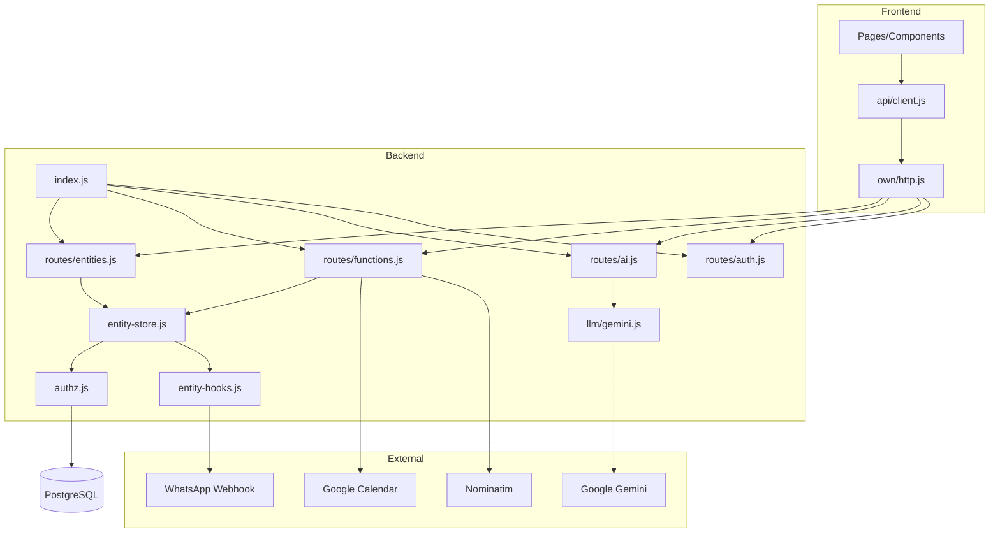

# מיפוי טכני מלא — Travvin

> ניתוח קוד בלבד (ללא שינויים). תאריך: 2026-08-31

---

## 1. מבנה הפרויקט

```
final-version/
├── src/                    # Frontend — Vite + React 18
│   ├── api/                # לקוח API (api.entities, auth, functions, integrations)
│   ├── components/         # UI (chat, owner, admin, superadmin, customer, ui)
│   ├── pages/              # Routes
│   ├── lib/                # AuthContext, bookingPrice, regions, sanitize
│   └── hooks/
├── server/                 # Backend — Express + Prisma
│   ├── src/
│   │   ├── index.js        # Entry point
│   │   ├── routes/         # REST routers
│   │   ├── middleware/     # auth, entity-authz
│   │   ├── lib/            # entity-store, authz, llm, hooks, integrations
│   │   ├── jobs/           # crons (calendar, delayed-jobs, stay-messages)
│   │   ├── schemas/        # JSON Schema + RLS (*.jsonc)
│   │   └── seed/
│   └── prisma/schema.prisma
├── docs/                   # migration + ai-architecture-map
├── vite.config.js          # proxy /api → VITE_OWN_API_URL
├── docker-compose.yml      # Postgres 16
└── package.json            # monorepo-style (root + server/)
```

| Layer | Entry | Stack |
|-------|-------|-------|
| Frontend | `src/main.jsx` → `App.jsx` | React, React Router, TanStack Query, Tailwind, Radix |
| Backend | `server/src/index.js` | Express 4, Prisma 6, node-cron |
| DB | `DATABASE_URL` | PostgreSQL 16 (JSONB `records` + relational tables) |

---

## 2. Frontend

### 2.1 API Client

| File | Export | Called by | Input | Output | Dependencies |
|------|--------|-----------|-------|--------|--------------|
| `src/api/client.js` | `api` | כל הקומפוננטות | — | facade | `own/entities`, `auth`, `functions`, `integrations` |
| `src/api/own/http.js` | `ownFetch`, token helpers | כל ה-own clients | path, method, body, auth | JSON / throws | `VITE_OWN_API_URL`, localStorage |
| `src/api/own/entities.js` | `ownEntities` | UI CRUD | entity name, data | records | `ownFetch`, `realtime.js` |
| `src/api/own/auth.js` | `ownAuth` | `AuthContext`, login pages | email/password, OTP | tokens, user | `/api/auth/*` |
| `src/api/own/functions.js` | `ownFunctions.invoke` | owner panels, calendar | function name, payload | `{ data }` | `/api/functions/*` |
| `src/api/own/integrations.js` | `InvokeLLM`, `UploadFile` | chat components | prompt, schema | string/object, file_url | `/api/ai`, `/api/upload` |
| `src/api/own/realtime.js` | `createSubscribe` | entity `.subscribe()` | callback | create/update/delete events | polling (default) or SSE |

**ישויות ב-client (`entities.js`):** 14 — AdminPermission, BookingRequest, ChatSession, Contact, CustomerProfile, DirectChat, OwnerRequest, Promotion, Review, SyncState, SystemMessage, UnansweredQuestion, User, Zimmer.

**פער:** `SupplierAutomationPanel.jsx` קורא ל-`api.entities.SupplierAutomation` — **לא מוגדר** ב-`entities.js`. Unknown אם broken ב-runtime.

### 2.2 Routing & Auth UI

| File | Function | Called by | Input | Output | Dependencies |
|------|--------|-----------|-------|--------|--------------|
| `src/App.jsx` | `AuthenticatedApp` | Router | pathname | page component | `AuthProvider`, `RoleGate` |
| `src/lib/AuthContext.jsx` | `AuthProvider`, `useAuth` | `App` | — | user, loading, errors | `/api/app/public-settings`, `/api/auth/me` |
| `src/components/auth/RoleGate.jsx` | `RoleGate` | routes | `allow`, `allowGuest` | children or redirect | `api.auth.me()` |

**Routes עיקריים:** `/`, `/welcome`, `/admin-login`, `/chat`, `/owner`, `/superadmin`, `/customer-portal`, `/desktop-search`, `/promotions`, `/join`, `/account-settings`.

### 2.3 Pages מרכזיות

| Page | File | תפקיד |
|------|------|--------|
| Customer bot | `src/pages/CustomerChat.jsx` | חיפוש/הזמנה/שאלות + InvokeLLM ×2 |
| Desktop search | `src/pages/DesktopSearch.jsx` + `SearchChat.jsx` | חיפוש desktop + LLM |
| Owner panel | `src/pages/OwnerPanel.jsx` | CRUD צימרים, bookings, assistant |
| Super admin | `src/pages/SuperAdminPanel.jsx` | ניהול owners, reviews, messages |
| Customer portal | `src/pages/CustomerPortal.jsx` | VacationAgentChat, bookings, reviews |

---

## 3. Backend

| File | Function | Called by | Input | Output | Dependencies |
|------|--------|-----------|-------|--------|--------------|
| `server/src/index.js` | bootstrap | `node` | env | HTTP server | Prisma, routers, crons, storage |
| `server/src/lib/entity-store.js` | `createEntityStore` | routes, hooks, libs | entityType, data, actor | public records | Prisma, authz, schema-loader, booking-guards |
| `server/src/lib/schema-loader.js` | `validatePayload`, `getEntityMeta` | entity-store, authz | entity JSON | Zod validation, RLS meta | `schemas/*.jsonc` |
| `server/src/lib/user-store.js` | CRUD users | entity-store, auth routes | user fields | User objects | `prisma.user` |
| `server/src/lib/entity-hooks.js` | `afterCreate`, `afterUpdate` | entity-store hooks | record | side effects | notifications, delayed jobs |
| `server/src/lib/entity-events.js` | `publishEntityChange` | entity-store | SSE events | EventEmitter | `/api/events` |

**אין** Controller/Service/Repository נפרדים — pattern: **Route → lib → entity-store → Prisma**.

---

## 4. Routes

| Router | File | Mount | Auth |
|--------|------|-------|------|
| Health | `index.js` | `GET /api/health` | None |
| Auth | `routes/auth.js` | `/api/auth` | mixed |
| App settings | `routes/app-settings.js` | `/api/app` | None (public-settings) |
| Users | `routes/users.js` | `/api/users` | admin invite |
| Entities | `routes/entities.js` | `/api/entities` | optional JWT + RLS |
| Bookings | `routes/bookings.js` | `/api/bookings` | None (busy only) |
| Events | `routes/events.js` | `/api/events` | JWT (SSE) |
| Functions | `routes/functions.js` | `/api/functions` | per-endpoint |
| AI | `routes/ai.js` | `/api/ai` | **None** |
| Upload | `routes/upload.js` | `/api/upload` | JWT |
| Google Calendar | `routes/connectors/google-calendar-oauth.js` | `/api/connectors/google-calendar` | JWT |

---

## 5. Middleware

| File | Function | Called by | Input | Output | Dependencies |
|------|--------|-----------|-------|--------|--------------|
| `middleware/auth.js` | `createAuthMiddleware` | `index.js` global | Bearer / `?token=` | `req.user`, `req.actor` | jwt, user-store, authz.normalizeActor |
| `middleware/auth.js` | `requireAuth` | protected routes | req.user | 401 or next | — |
| `middleware/auth.js` | `requireOwnerOrAdmin` | sendGuest/Supplier | role | 403 or next | — |
| `middleware/auth.js` | `requireCustomer` | Unknown usage in routes grep | role=user | 403 or next | — |
| `middleware/entity-authz.js` | `attachActor` | entities router | headers / existing actor | `req.actor` | authz.normalizeActor |

**סדר:** `cors` → `express.json` → `attachAuthUser` → route-specific middleware.

---

## 6. Authentication

| File | Function | Called by | Input | Output | Dependencies |
|------|--------|-----------|-------|--------|--------------|
| `lib/jwt.js` | `signToken`, `verifyToken` | auth routes, middleware | user claims | JWT string / claims | `JWT_SECRET` |
| `lib/password.js` | hash/verify | login, register | password | bcrypt hash | bcryptjs |
| `lib/otp.js` | OTP lifecycle | register, reset | email, code | ok/error | `prisma.otpCode`, `passwordResetToken` |
| `lib/google-oauth.js` | Google login | `/api/auth/google` | OAuth code | profile | Google APIs |
| `lib/auth-role-intent.js` | role intent | Google signup | intent=user/owner/admin | role assignment | — |
| `routes/auth.js` | login/register/OTP/Google | frontend | credentials | `access_token`, user | Prisma users |

**Actor shape:** `{ id, email, role }` — אין org/tenant.

**Token storage (frontend):** `localStorage.access_token`.

---

## 7. Authorization

| File | Function | Called by | Input | Output | Dependencies |
|------|--------|-----------|-------|--------|--------------|
| `lib/authz.js` | `can`, `assertCan` | entity-store | entity, action, actor, record | boolean / 403 | RLS from `schemas/*.jsonc` |
| `lib/authz.js` | `readScopeWhere` | entity-store list/filter | entity, actor | Prisma where fragment | RLS rules |
| `lib/service-role.js` | `SERVICE_ACTOR` | crons, internal libs | — | bypass actor | — |

**RLS:** מוגדר per-entity ב-JSONC (`user_condition`, `data.owner_id`, `$or`, וכו').

**ישויות ללא RLS מוגדר:** open by default (ראה `authz-baseline.md`).

**Owner assistant:** `executeOwnerAssistantOp` — `actor.id === ownerId` (או admin) + zimmer ownership.

---

## 8. AI Integration

| File | Function | Called by | Input | Output | Dependencies |
|------|--------|-----------|-------|--------|--------------|
| `routes/ai.js` | `POST /invoke-llm` | frontend | `{ prompt, response_json_schema?, add_context_from_internet?, model? }` | `{ result }` | invokeLlm |
| `lib/llm/index.js` | `invokeLlm` | ai route, generateAIRecommendations | payload | string or object | gemini.js, `LLM_MOCK` |
| `lib/llm/gemini.js` | `invokeGemini` | invokeLlm | prompt, schema, internet flag | parsed JSON/text | Google Gemini REST API |
| `lib/generate-ai-recommendations.js` | `generateAIRecommendations` | cron/functions (לא UI) | booking_id / zimmer+customer | recommendations JSON | invokeLlm, entity-store |
| `lib/owner-assistant-ops.js` | `executeOwnerAssistantOp` | functions route | operation JSON | zimmer/booking result | entity-store whitelist |

**Provider:** Google Gemini בלבד (`GEMINI_API_KEY`).

**Default model:** `gemini-3.5-flash` (`GEMINI_MODEL`).

**Internet grounding:** `google_search` tool (VacationAgentChat only).

**אין:** OpenAI SDK, agent loop, server-side tool execution.

**ארכיטקטורה:**

```
React (בונה prompt + history + context)
  → POST /api/ai/invoke-llm (ללא auth)
  → Gemini REST
  → JSON/text
  → React מפרש ומפעיל פעולות
```

---

## 9. כל AI Call Sites (13)

| # | File | Function | Schema? | Internet? |
|---|------|----------|---------|-----------|
| 1 | `CustomerChat.jsx` | date search flow | ✓ JSON | — |
| 2 | `CustomerChat.jsx` | `handleSend` | ✓ JSON | — |
| 3 | `SearchChat.jsx` | initial search | ✓ JSON | — |
| 4 | `SearchChat.jsx` | follow-up chat | ✓ JSON | — |
| 5 | `VacationAgentChat.jsx` | `send` | — text | ✓ |
| 6 | `OwnerInfoAssistant.jsx` | `runPrompt` | ✓ JSON | — |
| 7 | `AdminAssistantChat.jsx` | `handleSend` | ✓ JSON | — |
| 8 | `BookingCreatorChat.jsx` | `handleSend` | ✓ JSON | — |
| 9 | `ZimmerCreatorChat.jsx` | `handleSend` | ✓ JSON | — |
| 10 | `OwnerDashboard.jsx` | tips | — text | — |
| 11 | `ChatHistoryPanel.jsx` | summarize session | — text | — |
| 12 | `InfoSummaryEditor.jsx` | generate summary | — text | — |
| 13 | `ZimmerDatabase.jsx` | `generateSummary` | — text | — |

**+1 server-side:** `generate-ai-recommendations.js` (prompt בשרת, לא מה-UI).

**Call chain:** Component → `api.integrations.Core.InvokeLLM` → `POST /api/ai/invoke-llm` (auth=false) → `invokeLlm` → `invokeGemini` → Google API.

---

## 10. כל ה-Prompts

| Location | System role (Hebrew) | Structured output |
|----------|---------------------|-------------------|
| `CustomerChat.jsx` (~386) | בוט צימרים — דירוג 5 צימרים | `{action, zimmer_ids, message}` |
| `CustomerChat.jsx` (~565) | בוט צימרים — שיחה + actions | `{action, zimmer_ids, zimmer_id, unanswered_question, message}` |
| `SearchChat.jsx` (~124, ~188) | בוט צימרים desktop | same as CustomerChat |
| `VacationAgentChat.jsx` (~103) | סוכן נופש אישי | free text |
| `OwnerInfoAssistant.jsx` (~243) | עוזר בעלים — info/edit modes | `{message, operation, actions}` |
| `AdminAssistantChat.jsx` (~78) | עוזר ניהול — עריכת צימר | `{action, message, changes}` |
| `BookingCreatorChat.jsx` (~67) | עוזר הוספת הזמנה | `{action, message, booking}` |
| `ZimmerCreatorChat.jsx` (~75) | עוזר יצירת צימר | `{action, message, zimmer_data}` |
| `OwnerDashboard.jsx` (~96) | יועץ עסקי | free text tip |
| `ChatHistoryPanel.jsx` (~22) | סיכום שיחה | free text summary |
| `InfoSummaryEditor.jsx` (~33) | סיכום info_summary | free text |
| `ZimmerDatabase.jsx` (~34) | סיכום data_zones | free text |
| `generate-ai-recommendations.js` (~115) | עוזר נופש + tags | `{restaurants, attractions, trails, ...}` |

**System prompt בשרת:** רק `generate-ai-recommendations.js`. כל השאר — **frontend**.

---

## 11. כל ה-AI Actions

Frontend מפרש JSON — **אין tools רשומים בשרת**:

| Action / Operation | Where interpreted | Implementation | DB mutation |
|-------------------|-------------------|----------------|-------------|
| `search` | CustomerChat, SearchChat | UI cards | No |
| `answer` | CustomerChat, SearchChat | text only | No |
| `booking` | CustomerChat, SearchChat | booking form | Yes → BookingRequest.create |
| `unanswered_question` | CustomerChat, SearchChat | question form | Yes → UnansweredQuestion.create |
| `view` | CustomerChat (legacy) | zimmer cards | No |
| `operation.create_zimmer` | OwnerInfoAssistant | `executeOwnerAssistantOp` | Yes |
| `operation.update_zimmer` | OwnerInfoAssistant | `executeOwnerAssistantOp` | Yes |
| `operation.create_booking` | OwnerInfoAssistant | `executeOwnerAssistantOp` | Yes |
| `actions[]` (calendar, bookings…) | OwnerInfoAssistant | `onNavigate` UI | No |
| admin `update` + `changes` | AdminAssistantChat | `Zimmer.update` direct | Yes |
| booking chat `create` | BookingCreatorChat | `BookingRequest.create` direct | Yes |
| zimmer chat `build` | ZimmerCreatorChat | `onSave` → create | Yes |

---

## 12. כל DB Access

### Prisma models (`schema.prisma`)

| Model | Table | Access via |
|-------|-------|------------|
| `Record` | `records` | entity-store (JSONB entities) |
| `User` | `users` | user-store + auth routes |
| `OtpCode` | `otp_codes` | otp.js |
| `PasswordResetToken` | `password_reset_tokens` | auth routes |
| `AppSettings` | `app_settings` | app-settings route, seed |
| `CalendarConnection` | `calendar_connections` | calendar-connection-store |
| `DelayedJob` | `delayed_jobs` | delayed-jobs.js |
| `HealthProbe` | `health_probe` | Unknown usage |

### Direct Prisma callers (non entity-store)

| File | Operations |
|------|------------|
| `entity-store.js` | `prisma.record.*` (CRUD) |
| `user-store.js` | `prisma.user.*` |
| `otp.js` | `prisma.otpCode.*` |
| `auth.js` | `prisma.user.*`, `passwordResetToken.*` |
| `bookings.js` | `prisma.record.findMany` (busy) |
| `booking-guards.js` | overlap queries + lock |
| `calendar-connection-store.js` | `calendarConnection.*` |
| `delayed-jobs.js` | `delayedJob.*` |
| `app-settings.js` | `appSettings.findUnique` |
| `seed/run.js` | users, records, appSettings |

---

## 13. Prisma

| Item | Detail |
|------|--------|
| Client | `@prisma/client` v6.14 |
| Generator | `prisma-client-js` |
| Migrations | `prisma migrate` + SQL scripts in `prisma/sql/` |
| Entity pattern | Generic `Record` + `entityType` + `data` JSONB |
| User entity | Separate `users` table (not JSONB) |
| Hooks | afterCreate/afterUpdate via entity-store options |

---

## 14. PostgreSQL

| Item | Detail |
|------|--------|
| Provider | PostgreSQL 16 (docker-compose / Render) |
| Connection | `DATABASE_URL` + `DIRECT_URL` (Prisma) |
| JSONB | All business entities in `records.data` |
| Indexes | entityType, createdById, dates |
| Transactions | BookingRequest.create with `withZimmerBookingLock` |
| Local dev | `docker compose up -d` — user/pass/db: `travvin` |

---

## 15. נקודות כניסה של Mutations

### Server-enforced (hardened)

| Entry | File | Auth | Whitelist |
|-------|------|------|-----------|
| `POST /api/functions/executeOwnerAssistantOp` | `owner-assistant-ops.js` | JWT owner/admin | create/update zimmer, create booking |
| `POST /api/functions/performCheckout` | `perform-checkout.js` | JWT | checkout fields only |
| `POST /api/functions/sendGuestMessage` | `send-guest-message.js` | owner/admin | guest messaging |
| `POST /api/functions/sendSupplierMessage` | send-supplier-message.js | owner/admin | supplier messaging |
| Entity CRUD | `entity-store.js` | RLS per schema | validation + booking-guards |

### Frontend-direct (via `/api/entities/*`)

| Entity | Main callers |
|--------|--------------|
| BookingRequest | CustomerChat, DesktopSearch, ManualBookingForm, BookingCreatorChat, OwnerBookingsList |
| Zimmer | OwnerPanel, AdminAssistantChat, SuperAdminPanel, QuestionsPanel |
| UnansweredQuestion | CustomerChat, SearchChat, QuestionsPanel |
| Review | CustomerReviewsTab, ReviewsPanel, SuperAdminReviewsPanel |
| ChatSession | CustomerChat, ChatHistoryPanel |
| DirectChat | DirectChat.jsx |
| Promotion | PromotionsPanel, CustomerChat |
| Contact | ContactsBook |
| CustomerProfile | CustomerProfileTab, CustomersPanel |
| SystemMessage | MessagesPanel |
| AdminPermission | AdminsPanel |
| SyncState | CalendarSyncCard |

### Internal-only (hooks/crons)

| Trigger | Mutation |
|---------|----------|
| `entity-hooks.js` | SystemMessage (notifications), GuestMessage, delayed jobs |
| `stay-messages-cron.js` | scheduled guest/supplier messages |
| `delayed-jobs-worker.js` | Review auto-publish |
| `calendar-auto-sync.js` | SyncState updates |

---

## 16. Conversation / History Mechanisms

| Chat | Persisted? | Mechanism | File |
|------|------------|-----------|------|
| CustomerChat (guest) | ✓ | `localStorage` key `cc_state_v1` | `CustomerChat.jsx` |
| CustomerChat (logged in) | ✓ partial | `ChatSession` entity (messages, summary, zimmer_ids_shown) | `CustomerChat.jsx` |
| CustomerChat resume | ✓ | `sessionStorage.resume_messages` | `CustomerHistoryTab.jsx` |
| OwnerInfoAssistant | ✗ | React state only | `OwnerInfoAssistant.jsx` |
| VacationAgentChat | ✗ | React state | `VacationAgentChat.jsx` |
| SearchChat | ✗ | in-memory | `SearchChat.jsx` |
| AdminAssistantChat | ✗ | React state | `AdminAssistantChat.jsx` |
| BookingCreatorChat | ✓ partial | `collectedData` state across turns | `BookingCreatorChat.jsx` |
| DirectChat | ✓ | `DirectChat.messages[]` entity | `DirectChat.jsx` |
| ChatSession.summary | ✓ | LLM summary via superadmin | `ChatHistoryPanel.jsx` |

**History in prompts:** slice of last N messages embedded in prompt string (8–20 turns). **אין** conversationId / tool_calls API.

---

## 17. External Integrations

| Integration | File | Protocol | Auth |
|-------------|------|----------|------|
| Google Gemini | `lib/llm/gemini.js` | REST `generativelanguage.googleapis.com` | `GEMINI_API_KEY` |
| Google OAuth (login) | `lib/google-oauth.js`, `routes/auth.js` | OAuth2 | `GOOGLE_CLIENT_ID/SECRET` |
| Google Calendar | `lib/sync-google-calendar.js`, `google-calendar-oauth.js` | OAuth + Calendar API | per-owner refresh token (encrypted) |
| Nominatim geocoding | `lib/geocode-addresses.js` | HTTP OpenStreetMap | User-Agent throttle |
| WhatsApp webhook | `lib/send-guest-message.js` | POST to configurable URL | `AppSetting` keys |
| Local file storage | `lib/storage/local-disk.js` | disk + static serve | JWT upload |
| Stripe | frontend deps only | `@stripe/*` in package.json | Unknown if wired in UI |

**Crons (server startup):**

| Job | File | Schedule | Disable env |
|-----|------|----------|-------------|
| Calendar auto-sync | `jobs/calendar-auto-sync.js` | periodic | `CALENDAR_CRON_DISABLED=1` |
| Delayed jobs | `jobs/delayed-jobs-worker.js` | periodic | `DELAYED_JOBS_DISABLED=1` |
| Stay/supplier messages | `jobs/stay-messages-cron.js` | hourly `0 * * * *` IL | `STAY_MESSAGES_CRON_DISABLED=1` |

---

# סיכומים

## Architecture Overview

```
┌─────────────────────────────────────────────────────────────┐
│  React SPA (Vite :5173)                                     │
│  • Prompt building + action dispatch (business orchestration)│
│  • api client → VITE_OWN_API_URL or /api proxy              │
└──────────────────────────┬──────────────────────────────────┘
                           │ HTTP JSON
┌──────────────────────────▼──────────────────────────────────┐
│  Express API (:3001)                                          │
│  • Optional JWT → req.actor                                   │
│  • /api/entities → entity-store → authz (RLS) → Prisma       │
│  • /api/ai/invoke-llm → Gemini proxy (NO AUTH)               │
│  • /api/functions → business ops (auth + whitelists)         │
│  • Crons: calendar, reviews, stay messages                   │
└──────────────────────────┬──────────────────────────────────┘
                           │
┌──────────────────────────▼──────────────────────────────────┐
│  PostgreSQL 16                                               │
│  records (JSONB) + users + calendar_connections + jobs       │
└─────────────────────────────────────────────────────────────┘
```

**עיקרון:** AI orchestration חי ב-**React**; השרת = data layer + Gemini proxy + hardened mutations.

---

## Dependency Map



---

## AI Flow

```
User message
  → React loads context (api.entities.*)
  → Build Hebrew prompt + history
  → POST /api/ai/invoke-llm (no auth)
    → invokeLlm → invokeGemini → Google API
  ← { result: JSON | string }
  → React parses action/operation/changes
  → Branch:
      UI only
      OR POST /api/functions/executeOwnerAssistantOp (JWT)
      OR POST/PATCH /api/entities/* (JWT/guest + RLS)
        → entity-store → Prisma → PostgreSQL
```

---

## Database Flow

```
Mutation request
  → /api/entities/:entity  OR  /api/functions/*
    → attachActor (JWT or anonymous)
    → assertCan (RLS) — except SERVICE_ACTOR internal
    → validatePayload (Zod from JSONC)
    → booking-guards (BookingRequest overlap/price)
    → prisma.record.create|update|delete  OR  prisma.user.*
    → publishEntityChange (SSE)
    → entity-hooks (notifications, delayed jobs)
```

---

## Authentication Flow

```
Register: email+password → OTP → verify-otp → JWT
Login: email+password → JWT
Google: /api/auth/google → callback → JWT in redirect ?access_token=
Every request: Bearer → attachAuthUser → req.user + req.actor
Frontend: localStorage.access_token → ownFetch Authorization header
SSE: ?token= query param (EventSource limitation)
Logout: clear token + cc_state_v1
```

---

## Authorization Flow

```
req.actor = { id, email, role }
  → entity-store.can(entity, action, actor, record)
    → RLS rules from schemas/*.jsonc
    → templates {{user.id}}, role checks, owner_id scoping
  → Functions: requireAuth + role checks + ownership in lib
  → executeOwnerAssistantOp: actor.id === ownerId + zimmer ownership
  → Undeclared RLS entities: open (documented in authz-baseline.md)
```

**פערי אבטחה ידועים:** `/api/ai/invoke-llm` ללא auth; mutations לא אחידות (whitelist vs direct entity writes).

---

## Frontend Business Logic (לא רק UI)

| Area | File(s) | Logic |
|------|---------|-------|
| Booking pricing | `src/lib/bookingPrice.js` | seasonal, partial, weekday/weekend, rankZimmersByFit |
| Availability | `DateSearchWidget.jsx` | getBookedZimmerIds via `/api/bookings/busy` |
| Prompt sanitization | `src/lib/sanitizePromptData.js` | untrusted text in prompts |
| Booking errors | `src/lib/bookingErrors.js` | user-facing error mapping |
| Regions | `src/lib/regions.js` | region filters |
| Info summary merge | `src/lib/infoSummary.js` | snapshot logic |
| CustomerChat orchestration | `CustomerChat.jsx` | search ranking, action dispatch, session persist |
| Owner assistant prep | `OwnerInfoAssistant.jsx` | prepareAssistantOp, mode info/edit |
| BookingCreatorChat | `BookingCreatorChat.jsx` | inferBookingStatus, collectedData merge |
| Role routing | `RoleGate.jsx`, `App.jsx` | guest vs authenticated paths |
| Realtime diff | `realtime.js` | polling diff or SSE |
| Auth bootstrap | `AuthContext.jsx`, `app-params.js` | token from URL, public settings |

**חשוב:** חישוב `total_price` ב-create booking נעשה **בשרת** (`booking-guards.js`); frontend מחשב תצוגה בלבד.

---

## רשימת Endpoints

| Method | Path | Auth | Handler |
|--------|------|------|---------|
| GET | `/api/health` | — | index.js |
| GET | `/api/auth/me` | optional | auth.js |
| POST | `/api/auth/login` | — | auth.js |
| POST | `/api/auth/register` | — | auth.js |
| POST | `/api/auth/verify-otp` | — | auth.js |
| POST | `/api/auth/resend-otp` | — | auth.js |
| POST | `/api/auth/reset-password-request` | — | auth.js |
| POST | `/api/auth/reset-password` | — | auth.js |
| PATCH | `/api/auth/me` | JWT | auth.js |
| GET | `/api/auth/google` | — | auth.js |
| GET | `/api/auth/google/callback` | — | auth.js |
| GET | `/api/app/public-settings` | optional | app-settings.js |
| POST | `/api/users/invite` | admin JWT | users.js |
| GET | `/api/entities` | actor | entities.js |
| GET | `/api/entities/:entity` | actor | entities.js |
| POST | `/api/entities/:entity/filter` | actor | entities.js |
| GET | `/api/entities/:entity/:id` | actor | entities.js |
| POST | `/api/entities/:entity` | actor | entities.js |
| PATCH | `/api/entities/:entity/:id` | actor | entities.js |
| PUT | `/api/entities/:entity/:id` | actor | entities.js |
| DELETE | `/api/entities/:entity/:id` | actor | entities.js |
| GET | `/api/bookings/busy` | — | bookings.js |
| GET | `/api/events/entities/:entity` | JWT (SSE) | events.js |
| POST | `/api/functions/geocodeAddresses` | JWT | functions.js |
| POST | `/api/functions/addBookingToCalendar` | JWT | functions.js |
| POST | `/api/functions/executeOwnerAssistantOp` | JWT | functions.js |
| POST | `/api/functions/syncGoogleCalendar` | JWT/workflow | functions.js |
| POST | `/api/functions/performCheckout` | JWT | functions.js |
| POST | `/api/functions/sendGuestMessage` | owner/admin | functions.js |
| POST | `/api/functions/sendSupplierMessage` | owner/admin | functions.js |
| POST | `/api/functions/generateAIRecommendations` | JWT | functions.js |
| POST | `/api/functions/pushInAppNotification` | **403 internal** | functions.js |
| POST | `/api/functions/finalizeReviewAutoPublish` | **403 internal** | functions.js |
| POST | `/api/functions/sendStayMessages` | **403 internal** | functions.js |
| POST | `/api/functions/sendScheduledSupplierMessages` | **403 internal** | functions.js |
| POST | `/api/ai/invoke-llm` | **—** | ai.js |
| POST | `/api/upload` | JWT | upload.js |
| GET | `/api/connectors/google-calendar/oauth` | JWT | google-calendar-oauth.js |
| GET | `/api/connectors/google-calendar/oauth/callback` | — | google-calendar-oauth.js |
| GET | `/api/connectors/google-calendar/status` | JWT | google-calendar-oauth.js |
| DELETE | `/api/connectors/google-calendar` | JWT | google-calendar-oauth.js |
| GET | `{storage.urlPrefix}/*` | — | static files |

---

## Unknowns / פערים שזוהו בקוד

1. **Rate limiting** על `/api/ai/invoke-llm` — לא בקוד.
2. **Schema files:** `schema-loader.js` מצהיר 18 entities; ב-repo נמצאו **14** קבצי `.jsonc` בלבד. חסרים: `GuestMessage`, `SupplierAutomation`, `SupplierMessage`, `AppSetting`.
3. **Frontend entities client** — 14 entities; `SupplierAutomation` בשימוש ב-UI אך לא ב-client list.
4. **Stripe** — dependency ב-package.json; חיבור effectual Unknown.
5. **`requireCustomer`** — מוגדר ב-middleware; לא נמצא בשימוש ב-routes.
6. **Production infra** (CORS, Render) — תלוי env (`FRONTEND_URL`, `render.yaml`).

---

## קישורים

- מיפוי AI ממוקד: [ai-architecture-map.md](./ai-architecture-map.md)
- baseline אבטחה: [migration/authz-baseline.md](./migration/authz-baseline.md)
- README: [../README.md](../README.md)
